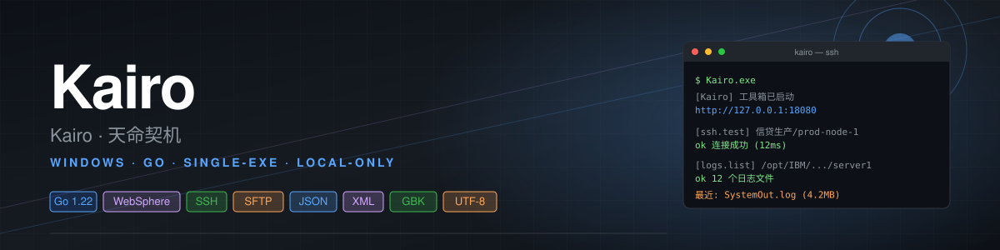

<p align="center">
  
</p>

# OpsToolbox · 内网运维工具箱

> Windows 绿色版 · 纯 Go · 单 exe · 启动即用 · 默认仅本机访问

一个面向内网运维场景的本地工具箱。

**v0.3（当前）** 在 v0.2 基础上新增：

- **文件浏览器（任意路径下载）**：左侧菜单「文件下载」，按 SSH 账号权限浏览任意目录，像 FTP 一样层层进入、勾选下载；多文件支持打包 zip；保留审计 + 进度条 + 取消
- **WebSphere 日志助手 · 指定文件下载**：在 v0.2 「下载最新 N 个」基础上，新增「勾选指定文件下载」，多文件带进度和 zip

**v0.4（发版前修复）** 在 v0.3 基础上做了一轮稳定性 + SSH 兼容性修复：

- **OpenSSH 6.2p2 / 老 sshd SSH 兼容性加固**：`x/crypto` 升到 v0.31.0；3 套 SSH profile 自动 fallback（兼容 → 移除 ECDH → legacy DH-sha1），覆盖老 AIX / WebSphere / 堡垒机；加入 `keyboard-interactive` 认证；握手 deadline 与 ctx 分离；`logs/ssh_traffic.log` 区分 C→S / S→C 方向，`ssh_debug.log` 打印实际编译进去的 `x/crypto` 版本
- **SSE 长连接不被 120s 强制断开**：`http.Server.WriteTimeout` 设成 0，保证 tail / 下载进度流不会被超时切断
- **Windows zip 打包不再因反斜杠误判失败**：`zipFiles` 用 `filepath.Abs + os.Open + f.Stat` 校验，本地路径天然支持；同时处理 zip 内同名文件
- **下载进度 SSE 中文 / Unicode 文件名输出合法 UTF-8**：`dlmanager.formatEvent` 改用 `encoding/json.Marshal`，不再手写 JSON 把 rune 截断为单字节
- **safeWriter 超过 8MB 后只追加一次 truncated marker**：防止老命令疯狂输出时内存继续涨
- **构建脚本容错**：`scripts/build_windows_amd64*.sh` 在没有 `config.yaml` 但有 `config.yaml.production.example` 时仍能打包；同时复制 `start.bat`
- **SSH Dial 超时统一常量**：`httpserver.sshDialOuterTimeout`（45s）+ `sshAttemptTimeout`（10s），所有 handler 统一使用，老 sshd + 3 套 profile 跑得完
- **SFTP 下载支持取消打断**：`runFilesDownloadTask` 在 ctx 取消时主动关闭 SFTP / SSH，正在下的大文件能马上停
- **任意路径下载前 Stat 拒绝目录**：避免 SFTP Open 在不同 server 行为不一致
- **任意路径下载同名不再覆盖**：本地文件名加 idx 前缀（001/002/...）
- **SSH Session 显式 Close**：减少老 sshd / 堡垒机 channel 泄漏
- **文件浏览器（任意路径下载）加配置开关**：`app.enable_free_file_browser: false` 时 `/api/files/*` 全部返回 403，方便发版给权限较宽的同事时关闭
- **下载历史不限 .log/.zip**：v0.3 任意路径下载的 .properties / .xml / .gz 等文件也能在「下载历史」页看到

**v0.2** 已包含：

- **系统配置可视化编辑器**：在「系统配置」页直接增删改业务系统 / 服务器 / 日志目录，保存后原子改写 `config.yaml`，无需重启
- **多服务器并行搜索**：在 WebSphere 日志页勾选多台服务器，1~16 路并发搜索，结果按服务器分组、显示命中数+耗时
- 配置文件读取（`config.yaml`，白名单校验）
- **WebSphere 日志助手**：测试连接、列出日志文件、下载最新日志、关键词搜索、查看上下文
- 报文格式化：JSON / XML 格式化、压缩、校验
- 本地审计日志（`logs/audit.log`，不写密码）

> v0.1 / v0.2 已验收；v0.3 重点是「文件下载」菜单。
> 验收清单见 [`docs/ACCEPTANCE.md`](docs/ACCEPTANCE.md)。

---

## 1. 给同事发什么

打包一个目录，里面是：

```
OpsToolbox.exe              # 主程序（Win10/11）
# 或者 OpsToolbox_win7.exe  # Win7 兼容版（用 Go 1.20 编译）
config.yaml                 # 配置文件（按需改 IP / 用户名 / 路径 / 模式）
README.md                   # 本文件
downloads/                  # 下载文件保存目录
logs/                       # 程序与审计日志
data/                       # 预留数据目录
```

**不要**把源码、scripts、docs、dist 目录发出去。

打包方式：

```bash
# macOS / Linux
./scripts/build_windows_amd64.sh v0.1.0      # Win10/11
GO120_HOME=~/sdk/go120 ./scripts/build_windows_amd64_win7_go120.sh v0.1.0  # Win7
./scripts/package_windows.sh v0.1.0
# → dist/ops-toolbox-v0.1.0-windows.zip
```

---

## 2. Windows 上怎么跑

**不要先双击 exe**，先用 cmd 启动看完整日志：

```bat
cd /d D:\ops-toolbox
OpsToolbox.exe
```

正常启动后控制台会输出：

```
[OpsToolbox] 2026/06/19 10:00:00.000 工具箱已启动: http://127.0.0.1:18080
[OpsToolbox] 2026/06/19 10:00:00.000 工作目录: D:\ops-toolbox
[OpsToolbox] 2026/06/19 10:00:00.000 下载目录: D:\ops-toolbox\downloads
[OpsToolbox] 2026/06/19 10:00:00.000 审计日志: D:\ops-toolbox\logs\audit.log
```

浏览器自动打开 `http://127.0.0.1:18080`。如果没自动打开，手动访问这个地址。

关闭程序：直接关闭控制台窗口。

---

## 3. 改 config.yaml

打开 `config.yaml`，按需修改：

```yaml
app:
  name: 内网运维工具箱
  host: 127.0.0.1                # 必须是 127.0.0.1 或 localhost，0.0.0.0 启动会被拒
  port: 18080                    # 端口被占用就换一个
  auto_open_browser: true
  download_dir: ./downloads
  log_dir: ./logs
  data_dir: ./data

systems:
  - name: 信贷生产                # 业务系统名
    description: WebSphere 生产集群
    servers:
      - name: prod-node-1
        host: 10.10.10.11
        port: 22
        username: wasadmin       # 页面也可以覆盖
        auth_type: password      # 第一版仅支持 password
        log_dirs:
          - name: server1日志
            path: /opt/IBM/WebSphere/AppServer/profiles/AppSrv01/logs/server1
            patterns:
              - SystemOut*.log
              - SystemErr*.log
              - "*.log"
            encoding: utf-8      # utf-8 (默认) 或 gbk
```

**重要约束**：

- 密码**不要**写在这里 — 每次在 Web 页面输入
- `log_dirs.path` 是白名单，工具只访问这里声明的目录
- `patterns` 禁止包含 `;` `|` `&` `\` `` ` `` `$` `(` `)` `<` `>` `"` `'` `*` `?` 等
- `encoding` 仅支持 `utf-8` / `gbk` / `gb18030`
- 远程日志是 GBK 时：`encoding: gbk`（自动转 UTF-8 给页面）

改完保存即可，**不用重启**…v0.1 第一版需要重启，**v0.2 起可以直接在「系统配置」页可视化编辑，保存后立即生效**。手编 yaml 仍有效，编辑器最终也是写回同一个 yaml。

---

## 4. macOS 上交叉编译 Windows exe

```bash
cd ops-toolbox

# 主版本（Win10/11，需要 Go 1.20+ 工具链，本机默认 Go 1.22+）
GOOS=windows GOARCH=amd64 CGO_ENABLED=0 go build -trimpath -ldflags "-s -w" -o OpsToolbox.exe .
```

或者用脚本：

```bash
./scripts/build_windows_amd64.sh v0.1.0
./scripts/package_windows.sh v0.1.0
# → dist/ops-toolbox-v0.1.0-windows.zip
```

### 4.1 编译 Win7 兼容版

Go 1.21+ **不再支持** Windows 7/8/Server 2008/2012（要求 Win10/Server 2016+）。
要兼容 Win7，**必须**用 Go 1.20.x 编译。

```bash
# 1) 准备一个独立的 Go 1.20.x（不要 brew install）
curl -L -o /tmp/go1.20.14.darwin-amd64.tar.gz \
  https://go.dev/dl/go1.20.14.darwin-amd64.tar.gz
mkdir -p ~/sdk/go120
tar -C ~/sdk/go120 -xzf /tmp/go1.20.14.darwin-amd64.tar.gz --strip-components=1

# 2) 编译
export GO120_HOME=~/sdk/go120
./scripts/build_windows_amd64_win7_go120.sh v0.1.0
# → dist/ops-toolbox-v0.1.0-win7/OpsToolbox_win7.exe
```

> `go.mod` 顶部 `go 1.20` 已设置，依赖 (`x/crypto v0.31.0`、`x/text v0.21.0`) 都是 Go 1.20 兼容版本。
>
> 注：`golang.org/x/crypto` ≥ v0.21.0 才实现 `diffie-hellman-group14-sha256` / `group-exchange-sha*`，是 OpenSSH 6.2p2 / 老 sshd 兼容握手的关键。

---

## 5. 搜索语法

搜索框支持简单表达式：

| 表达式 | 含义 |
| --- | --- |
| `Exception` | 包含 Exception |
| `ORA-00060 && userinfo` | 同时包含两个关键词（同一行） |
| `SocketTimeoutException \|\| No more data` | 任一关键词 |
| `Exception && !DEBUG` | 含 Exception 且不含 DEBUG |
| `!DEBUG` | 排除含 DEBUG 的所有行 |

第一版只支持 `&&` / `||` / `!`，括号、字段语法暂不支持。

搜索结果中点 **查看上下文**，会用 `sed -n a,bp` 拿到命中行前后各 30 行（在配置中可调），不会下载整个文件。

---

## 6. 远程命令兼容性

工具依赖服务器端以下命令（除 `timeout` 外）：

| 命令 | 用途 | 必需 |
| --- | --- | --- |
| `find` | 列日志文件 | 是 |
| `grep` | 搜索 | 是 |
| `sed` | 取上下文行 | 是 |
| `sh` | 跑 shell | 是 |
| `sort` | 排序 | 是（一般 coreutils 自带） |
| `head` | 截断 | 是 |
| `cat` | 纯 NOT 模式时 | 是（busybox 也有） |
| `timeout` | ~~旧版用~~ | **否**（已移除，依赖 Go 侧 ctx） |

**`timeout` 命令不需要安装**。第一版原来在命令模板里带 `timeout`，后来改成了 Go 客户端的 `context + 内部 timer` + 超时后 `SIGTERM → 1s → SIGKILL` 三段式，保证老 Linux / Alpine / 精简镜像也能跑。

如要排查命令兼容性，可以在目标服务器上手工跑一下：

```bash
cd /opt/IBM/WebSphere/AppServer/profiles/AppSrv01/logs/server1
find . -maxdepth 1 -type f \( -name "SystemOut*.log" -o -name "*.log" \) \
  -printf '%s\t%T@\t%p\n' | sort -k2,2nr | head -n 100
```

如果这条命令在远端能跑出文件列表，那工具就能列出文件。

---

## 7. 编码（GBK / UTF-8）

老 WebSphere / Oracle / JSP 系统日志经常是 **GBK** 编码。

工具默认按 UTF-8 解码，遇到中文乱码时：

```yaml
log_dirs:
  - name: 老系统日志
    path: /opt/IBM/WebSphere/AppServer/profiles/AppSrv01/logs/server1
    patterns:
      - SystemOut*.log
    encoding: gbk        # 加这一行
```

支持的值：`utf-8`（默认）、`gbk`、`gb18030`。
底层用 `golang.org/x/text/encoding/simplifiedchinese.GBK` 自动转换。

> 远程命令**不会**去改文件编码 — 只是在拿到 stdout 之后在 Go 侧做转换。

---

## 8. 接口列表

| Method | Path | 用途 |
| --- | --- | --- |
| GET  | `/api/config` | 读取配置（不返回密码） |
| POST | `/api/ssh/test` | 测试 SSH 连接（password 可为空，自动从 keyring 读） |
| POST | `/api/logs/list` | 列出日志目录下的文件 |
| POST | `/api/logs/download-latest` | 下载最近 1~5 个日志文件（写 sidecar 元数据） |
| POST | `/api/logs/download` | 启动「指定文件下载」任务，立即返回 `{id}` |
| GET  | `/api/logs/download/{id}/events` | SSE 进度流（文件开始 / 进度 / 完成） |
| POST | `/api/logs/download/{id}/cancel` | 取消进行中的下载任务 |
| POST | `/api/logs/search` | 关键词搜索 |
| POST | `/api/logs/search/multi` | 多服务器并行搜索 |
| POST | `/api/logs/context` | 查看某行的上下文 |
| POST | `/api/logs/tail/start` | 启动实时 tail（SSE 流） |
| POST | `/api/files/list` | **v0.3** 列任意远端目录（按 SSH 账号权限放行） |
| POST | `/api/files/download` | **v0.3** 启动「任意路径下载」任务，立即返回 `{id}` |
| GET  | `/api/files/download/{id}/events` | **v0.3** SSE 进度流 |
| POST | `/api/files/download/{id}/cancel` | **v0.3** 取消进行中的下载任务 |
| GET  | `/api/audit/recent` | 操作历史（按 op / system / server / result 过滤） |
| POST | `/api/credentials/save` | 保存 SSH 密码到系统钥匙串 |
| GET  | `/api/credentials/has` | 检查是否已保存密码（不返回密码本身） |
| POST | `/api/credentials/clear` | 删除已保存的密码 |
| GET  | `/api/downloads/list` | 列出 downloads/ 目录里所有已下载文件 + 元数据 |
| DELETE | `/api/downloads/<name>` | 删除单个下载文件 |
| POST | `/api/downloads/all` | 清空 downloads/ 里所有文件 |
| POST | `/api/format/json` | JSON 格式化 / 压缩 / 校验 |
| POST | `/api/format/xml` | XML 格式化 / 压缩 |
| GET  | `/downloads/<file>` | 下载本地 downloads/ 中的文件 |

所有接口都只允许本机访问（`127.0.0.1`）。

### 8.1 密码本地保存（keyring）

每次操作时，Web 页面可以勾选"记住密码"，后端会调用 `/api/credentials/save`
把密码存到 OS 钥匙串：

- **macOS** → Keychain
- **Windows** → DPAPI（wincred）
- **Linux** → Secret Service / D-Bus（libsecret 守护进程）

存储策略：
- 按 (system, server, username) 三元组存；
- 永远不写进 `audit.log`、URL、错误信息；
- 后续调用时如果请求里没传 `password`，后端会从 keyring 读；
- 页面有"忘记"按钮调用 `/api/credentials/clear` 删除。

如果当前平台没有可用的 keyring（比如 Linux 容器里没装 D-Bus），后端返回 503，
页面会显示"⚠ 系统钥匙串不可用"，密码需要每次手动输入。

### 8.2 下载历史（sidecar 元数据）

每次成功下载，文件旁边会写一个 `.meta` JSON，记录来源（系统 / 服务器 / 远端目录 / 原始文件名 / 编码 / 下载时间）：

```json
{
  "system": "信贷生产",
  "server": "prod-node-1",
  "host": "10.10.10.11:22",
  "dir": "/opt/IBM/WebSphere/AppServer/profiles/AppSrv01/logs/server1",
  "dir_alias": "server1",
  "file": "SystemOut.log",
  "encoding": "utf-8",
  "kind": "file",
  "downloaded_at": "2026-06-21T15:25:37.724668+08:00"
}
```

zip 的元数据里 `files` 字段记录包含的所有远端文件名。
「下载历史」页（侧栏）调用 `/api/downloads/list` 展示，删除/清空会同时移除数据文件和 sidecar。

---

## 9. 审计日志

所有用户操作（连接、列文件、下载、搜索、失败信息）都会写入 `logs/audit.log`，例如：

```
ts=2026-06-19 10:30:00.123 op=ssh.test system=信贷生产 server=prod-node-1 result=ok
ts=2026-06-19 10:30:05.456 op=logs.list system=信贷生产 server=prod-node-1 dir=/opt/... result=ok count=12
ts=2026-06-19 10:30:10.789 op=logs.search system=信贷生产 server=prod-node-1 dir=/opt/... query=Exception && userinfo result=ok hits=8
ts=2026-06-19 10:30:12.000 op=logs.download system=信贷生产 server=prod-node-1 dir=/opt/... file=SystemOut.log result=ok bytes=2048576
```

**不记录的**：SSH 密码、日志正文。

---

## 10. 安全设计

1. HTTP 服务只监听 `127.0.0.1`（`0.0.0.0` 会被配置校验拒绝）
2. 不允许用户输入任意 shell 命令
3. 所有远程命令由后端固定模板生成（`find` / `grep` / `sed` / `sort` / `head` 组合）
4. **WebSphere 日志助手**（`/api/logs/*`）的目录必须来自配置白名单 `log_dirs`，文件名只能来自 `find` 列出结果；**文件浏览器**（`/api/files/*`）按 v0.3 用户决策改为按 SSH 账号实际权限放行（不引白名单）
5. 搜索关键词做严格转义 + 白名单校验，禁止 ` ' \` $ ; & | < > ( ) { } [ ]` 等
6. 密码不会写入审计日志，也不会出现在错误信息中
7. **不提供删除 / 修改 / 上传远程文件的能力**（v0.3 文件浏览器依然只读 + 下载）
8. 下载文件只保存到 `downloads/`，URL 路径穿越会被拒绝
9. 命令超时由客户端 ctx + SIGTERM/SIGKILL 控制，不依赖服务器端 `timeout`
10. 任意路径下载做基础校验（路径必须绝对、不含 NUL/换行、单次最多 100 个文件、单任务 30 分钟硬超时）
11. v0.3 文件浏览器（任意路径下载）支持配置开关 `app.enable_free_file_browser: false` 一键关闭（参见 §11.5）

---

## 11. 文件浏览器（v0.3 新增）

左侧菜单「文件下载」，提供类似 FTP 的目录浏览 + 下载能力。

### 11.1 与「WebSphere 日志助手」的区别

| 维度 | WebSphere 日志助手 | 文件浏览器（v0.3） |
|---|---|---|
| 路径 | 只能浏览 `log_dirs` 白名单内的目录 | **任意绝对路径**，按 SSH 账号实际权限放行 |
| 用途 | 排查日志、搜索、上下文 | 拿任意文件（properties、xml、sql、bundle、jar 等）|
| 写权限 | 无 | 无（依然只读 + 下载） |
| 审计 | `op=logs.list / logs.download` | `op=files.list / files.download` |
| 入口 | 顶部菜单「WebSphere 日志」 | 顶部菜单「文件下载」 |

### 11.2 使用流程

1. 顶部菜单 → 「文件下载」
2. 选业务系统 + 服务器 + 输入 SSH 用户名 + 密码
3. 默认进入 `/home/<user>`；用面包屑跳转、点目录名进入子目录，或直接在路径框输入绝对路径后回车
4. 勾选文件（目录不可下载，必须先进去选文件）→ 点「下载选中」
5. 多文件可勾选「打包 zip」；下载有进度条，可取消
6. 完成后到「下载历史」页打开 / 删除 / 重新下载

### 11.3 硬约束（防误操作 / 连接卡死）

- 单次下载最多 **100** 个文件
- 单个下载任务超过 **30 分钟**自动 cancel
- 路径必须以 `/` 开头；不接受 `..` 穿越（依赖 SFTP 协议的 server 端实现）
- 所有列目录 / 下载进 `audit.log`，含 system / server / path / count / bytes

### 11.4 安全设计取舍

v0.3 之前，工具箱坚持「目录来自配置白名单」（v0.1 README 第 4 条安全设计）。
v0.3 应实际运维需求（同一台 WebSphere 服务器的 `logs/` `properties/` `config/` `installedApps/` 都要看），文件浏览器改为**按 SSH 账号实际权限放行**：

- 工具箱不做白名单限制；
- 真实访问控制交给 SSH 服务器端（账号 + 文件系统权限 + sshd_config）；
- 工具箱只做基础格式校验 + 审计 + 进度 / 取消。

写权限（上传、删除、改权限）依然全部禁止。

### 11.5 配置开关（关闭文件浏览器）

v0.4 起，`config.yaml` 可通过 `app.enable_free_file_browser` 控制整个 `/api/files/*` 是否可用：

```yaml
app:
  # 不写 / true = 启用（默认，向后兼容）
  # false = 整个 /api/files/* 返回 403，但日志助手 / 系统配置 / 报文格式化 / SSH 测试等其它功能照常
  enable_free_file_browser: true
```

适用场景：

- 把工具箱发给权限较宽的同事，担心被安全审计卡
- 临时下线"任意路径下载"，但保留日志助手白名单下载

关闭后日志助手（`/api/logs/*`）仍可用，因为白名单模式依然严格生效。

---

## 12. 源码目录结构（给二次开发者）

```
ops-toolbox/
├── main.go                      # 入口：解析 -workdir、加载 config、起 HTTP server
├── config.yaml                  # 运行时配置
├── README.md / docs/            # 用户文档 + 验收清单
├── scripts/                     # 交叉编译 / 打包脚本（macOS / Linux 上编 Win）
├── web/                         # 嵌入式前端（IIFE 风格单文件）
│   ├── index.html               # 单页应用骨架
│   ├── app.js                   # 全部前端逻辑（含 4 个 pure 函数单测可抽）
│   ├── app.test.js              # Node 单测：escapeHtml / formatBytes / formatTime /
│   │                            #   trimMiddle / cssEscape / pctText / validate
│   └── style.css
└── internal/
    ├── config/                  # config.yaml 加载 + 校验 + 热替换（COW Manager）
    ├── audit/                   # audit.log 写入（线程安全、不含 password 字段）
    ├── credentials/             # OS 钥匙串：macOS Keychain / Win DPAPI / Linux Secret Service
    ├── sshclient/               # SSH 客户端：拨号 + Run + Stream（GBK/UTF-8 透明）
    ├── sftpclient/              # SFTP 客户端：Open / ReadDir / Stat / DownloadFile[WithProgress]
    ├── logquery/                # 后端命令模板（list / search / context / tail）
    ├── tailmgr/                 # tail 会话池 + SSE 广播（Streamer 接口便于测试）
    ├── dlmanager/               # 异步下载任务池（logs + files 共用 ID 空间 + SSE）
    ├── formatter/               # JSON / XML 格式化（独立小工具）
    ├── downloads/               # 下载历史 sidecar 元数据（file.meta.json）
    └── httpserver/              # HTTP server
        ├── httpserver.go        # 入口 + 路由表（165 行）
        ├── response.go          # writeJSON / writeErr
        ├── helpers.go           # zipFiles / sanitize / humanBytes / resolveCreds /
        │                        #   auditErr
        ├── handlers_ssh.go / handlers_logs_*.go / handlers_files.go /
        │   handlers_tail.go / handlers_admin.go / handlers_audit.go /
        │   handlers_credentials.go / handlers_downloads.go / handlers_format.go
        │                        # 各路由按职责拆开
        ├── handlers_misc.go     # /downloads/<file>（带 RFC 5987 filename*）
        └── *_test.go            # 单测 + 集成测试（fake SSH + 注入 sftpDialer）
```

设计要点：
- 每个内部包都有一份单测；`go test ./...` 跑全包覆盖
- `httpserver` 抽 `sftpDialer` 包级变量，集成测试可注入 fake SFTP backend
- `tailmgr.Start` 接受 `Streamer` 接口，单测用可控 mock 覆盖 ctx 取消 / 流错 / GC 路径
- `dlmanager.Manager` 的 `GCInterval` 字段可调，巡检周期默认 15s、测试里调到 20ms

---

## 13. 第一阶段未做

- 密码本地保存（已做：macOS Keychain / Windows DPAPI / Linux Secret Service）
- 多文件 zip 打包下载（已做）
- 实时 tail（已做）
- 任意命令执行（设计为禁止）
- 多服务器并发搜索（v0.2 已完成，页面勾选+并行返回）
- 文件浏览器（v0.3 已做：任意路径浏览 + 下载）
- WebSphere 日志助手 · 指定文件下载（v0.3 已做）
- 数据库连接
- 常用命令模块（占位页面）

> 日期 / 日历、文本处理两个模块已从导航和首页移除，不规划。

---

## 14. 常见问题

**Q: 启动后浏览器没自动打开？**
A: 检查 `config.yaml` 的 `auto_open_browser: true`；或者手动访问 `http://127.0.0.1:18080`。

**Q: 端口被占用？**
A: 修改 `app.port`，例如改成 `18090`。

**Q: 搜索中文 / 特殊字符失败？**
A: 含 `;` `|` `&` `$` `\` `` ` `` 等的关键词会被直接拒绝（不是过滤，是拒绝）；去掉这些字符。

**Q: 中文乱码？**
A: 远端日志是 GBK 的话，在 `log_dirs` 里加 `encoding: gbk`。

**Q: 改了 config.yaml 不生效？**
A: v0.2 起在「系统配置」页直接编辑保存即可，无需重启。仍手编 yaml 的话需要重启 OpsToolbox.exe。

**Q: 想在多台服务器上并发搜索？**
A: v0.2 已支持。在 WebSphere 日志页勾选多台服务器（最多 16 路并发），点「搜索」会按服务器分组返回结果，每台独立显示命中数+耗时。

**Q: 想下载白名单目录之外的文件（比如 properties / xml / jar）？**
A: v0.3 新增「文件下载」菜单，按 SSH 账号权限浏览任意目录并下载，写操作依然禁止。详见 [§11 文件浏览器](#11-文件浏览器v03-新增)。

**Q: Win7 上跑不起来？**
A: 必须用 Go 1.20.x 编译的 `OpsToolbox_win7.exe`，主版本 `OpsToolbox.exe` 在 Win7 上跑不起来（Go 1.21+ 不再支持 Win7）。
