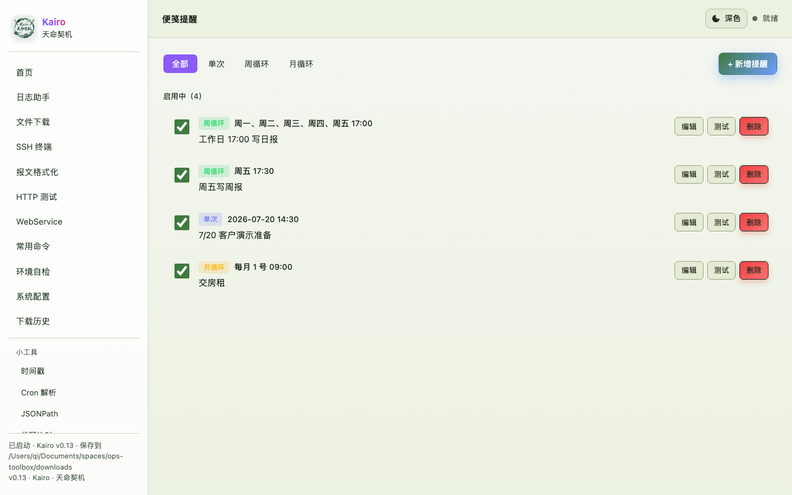
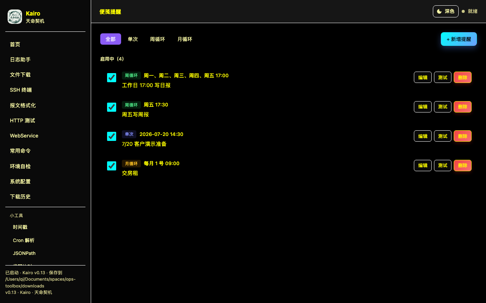
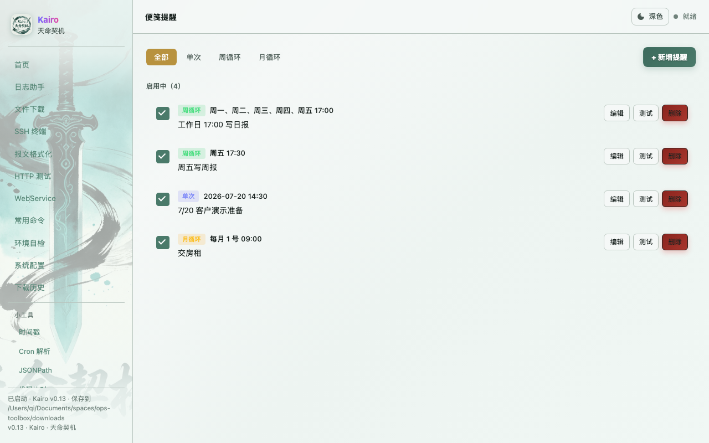
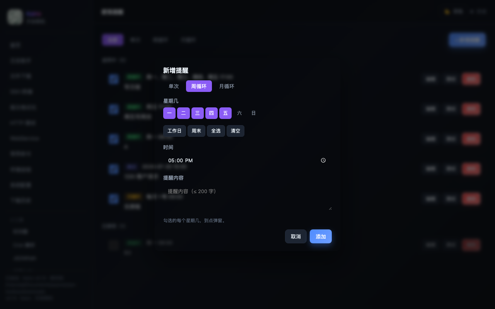

<div align="center">

# Kairo · 天命契机

**跨平台 · 纯 Go 单 exe · 启动即用 · 系统托盘常驻 · 默认仅本机访问**

把 **SSH 远程命令 / 交互式终端 / WebSphere 日志排查 / 任意路径文件下载 / 报文格式化 / WebService 调试 / HTTP 测试 / 定时提醒 / 投喂作者** 收敛到一个零依赖、绿色运行、本地优先的单 exe 中——面向内网运维 / DBA / SRE 的本地工具箱。

[](https://go.dev)
[](#)
[](#)
[](#)
[](#)
[](#)
[](#)
[](#)
[](#)
[](#)

[快速开始](#-快速开始) · [功能矩阵](#-功能矩阵) · [架构](#-架构) · [API 列表](#-api-列表) · [构建](#-构建与发布) · [更新日志](#-release-notes)

</div>

---

##  主题 × 5 套 · 跨平台 UI

Kairo 全栈自绘 5 套主题，深色 / 浅色 / 护眼绿 / 高对比 / 仙侠·墨韵青锋——xterm.js 终端、所有前端页面、系统托盘菜单、提醒弹窗都跟随主题联动。

| 深色（默认） | 护眼绿 | 高对比 | 仙侠·墨韵青锋 |
| :---: | :---: | :---: | :---: |
|  |  |  |  |
| IDE 标配，长时间盯屏首选 | 长时间看日志眼睛不累 | 老旧屏幕 / 投影 / 视障辅助 | 毛笔字 / 剑 / 水墨 · 仙侠主题，氛围拉满 |

切换：右上角主题按钮，循环 `dark → light → green → hc → xianxia → dark`，localStorage 记忆 + 跨进程持久化。

---

##  为什么是 Kairo

| 痛点 | Kairo 的解法 |
| --- | --- |
| 排查 WebSphere 老系统日志要 SSH 登十几台机器，循环 `grep` / `tail` | 浏览器里勾服务器 × 日志目录，1–16 路并发搜索，结果按主机分组 + 命中数 + 耗时 |
| 老 OpenSSH 6.2p2 / AIX / WebSphere 服务器 SSH 连不上 | 内置 5 套 SSH compat profile（`auto` 默认，按 modern → compat → no-ecdh → legacy 自动 fallback），`x/crypto v0.31.0` 完整支持 `diffie-hellman-group14-sha256` |
| GBK 编码的 `SystemOut.log` 拉到本地变乱码 | 在配置里写一行 `encoding: gbk`，Go 侧 `x/text/encoding` 透明转换；xterm.js 终端里也直显 |
| 每次远程命令都要等 `timeout` 命令 | 客户端 `context + SIGTERM(1s) → SIGKILL` 三段式超时，**远端不需要 `timeout`** |
| 一次要拉多个配置文件 / 报表 / jar | 「文件下载」按 SSH 账号实际权限浏览任意路径，多文件 zip，进度条 + 取消 + 同名加 idx 前缀 |
| 配置文件改完忘了重启 | 「系统配置」页可视化编辑，**保存即原子改写 yaml，无需重启**（COW 热替换） |
| 想追溯谁什么时候拉了哪个文件 | `logs/audit.log` 全操作流水 + `downloads/.kairo-meta.json` 索引 + SSH 凭据零明文 |
| 密码写在 yaml 里很危险 | OS 钥匙串（Keychain / DPAPI / Secret Service）按 `(system,server,user)` 三元组存储；`file` 模式走 AES-256-GCM + AAD |
| 老 Java / WebSphere / XFire 的 SOAP 接口要调试，SoapUI 太重 | WebService 调试中心：WSDL 导入（URL/文件）→ 自动生成 Envelope → 一键发送 + 模板 + 历史 + Mock |
| SSH 终端里想直接拖文件、在线编辑 | 内嵌 SFTP 浏览器（list / pwd / preview / download），v0.13.1 起支持在线编辑 + 大文件分片上传 |
| 容易忘写日报 / 房贷 / 客户跟进 | 定时提醒：单次 / 周循环 / 月循环，托盘弹 Win10+ Toast，暂停今日到次日 0 点 |
| 想给作者投喂又怕走错链接 | 「投喂作者」页：库迪 / 瑞幸 / 随机奶茶三栏榜 + 真实姓名 + 武林花名前缀 |
| 工具箱上线后没意识到任意路径下载开着 | 启动日志 WARNING 明确打 `enable_free_file_browser` + `free_file_roots` 状态 |

---

##  快速开始

### 方式 A · 直接运行发版 exe（同事拿到包就这样用）

1. 解压发版 zip 到任意目录，比如 `D:\kairo\`
2. **双击 `Kairo_win10.exe`**（Win10/11）或 `Kairo_win7.exe`（Win7）：
   - 无控制台黑窗口弹出（`-H windowsgui`）
   - 浏览器自动打开 `http://127.0.0.1:18092`（端口可在 `config.yaml` 改）
   - **系统托盘**（右下角）出现 Kairo 图标，常驻进程
3. 右键托盘图标可 **「打开浏览器」/ 「暂停今日提醒」（v1.0+）/ 「立即恢复」/ 「退出」**
4. 启动失败会弹 MessageBox 提示错误内容（按 Ctrl+C 可复制），同时写 `crash.log`
5. 运行日志在 `logs/kairo.log`；审计日志在 `logs/audit.log`（按天滚动为 `audit-YYYY-MM-DD.log`）

### 方式 B · 开发模式

```bash
git clone git@github.com:Qioooba/kairo.git
cd kairo
go run .
```

需要 Go 1.20+（Win7 兼容）；会自动打开 `http://127.0.0.1:18080`（`config.yaml` 没改时）。

### 第一次跑要做什么

1. 浏览器左侧菜单 → **系统配置**
2. 录入「业务系统 / 服务器 / 日志目录」（三层：系统 → 服务器 → 目录，支持可视化增删改）
3. 回到 **日志助手**，选目标 → 列文件 → 搜索 → Tail
4. 需要 properties / xml / jar 等不在白名单目录的文件？用 **文件下载** 或在 **SSH 终端** 里直接浏览
5. 第一次跑会要求激活（License 体系，详见下方「商业化」一节）

### 启动时会自动恢复哪些用户偏好（不用重设）

| 偏好 | 存哪 | 何时回填 |
| --- | --- | --- |
| **Tail 高亮规则** | `data/preferences.json` 的 `tail.highlights` | 主页 `app.js` 启动时 `GET /api/preferences` 拉到 `Kairo.state.tailHighlights`；websphere tail tab / 独立 tail 窗口共用 |
| **系统配置** | `config.yaml`（COW Manager 热替换） | 启动时 Load → 立即生效；页面保存后立即写盘 |
| **凭据模式** | `app.credential_store`（默认 keyring） | 启动时 `credentials.SetMode` |
| **SSH 日志 / compat profile** | `app.ssh_debug` / `app.ssh_traffic_dump` / `app.ssh_compat_profile` | 启动时 `sshclient.SetLogConfig` / `SetDefaultProfile` |
| **文件浏览器开关 + 路径白名单** | `app.enable_free_file_browser` / `app.free_file_roots` | 启动时打 WARNING（开）+ handler 即时校验 |
| **下载到指定目录开关 + 白名单** | `app.allow_custom_download_dir` / `app.allowed_download_roots` | 启动时 `TargetDirAllowed` 立即生效 |
| **Host key 强校验** | `app.allow_insecure_host_key`（默认 `false`，fail-closed） | 启动时校验；未配 `host_key_sha256` 的 server 直接拒绝 |
| **Tail 空闲回收** | `app.tail_idle_minutes`（默认 30 分钟，最小 5 分钟） | 启动时 `tailmgr.SetIdleAfter` |
| **浏览器偏好**（v1.x） | `data/browser_state.json`：`{kind:"chrome"/"default", path, updated_at}` | Win 下首次启动探测 Chrome（常见路径 + 注册表兜底），命中记下来；后续启动直接复用；`kairo --reset-browser` 清掉重来 |
| **License 状态** | `data/.kairo-license`（AES-GCM 加密 + AAD 绑 IP） | 启动时 `license.Check()` 预检；前端 `GET /api/license/status` 实时查询 |
| **定时提醒** | `data/.kairo-reminders.json` | 启动时 `reminder.Manager` 恢复；到点触发 → 系统通知 |

浏览器侧（localStorage，不进文件）跨刷新保留：

| 偏好 | 键 |
| --- | --- |
| 主题（dark / light / green / hc / xianxia） | `kairo_theme`（老 `dtb_theme` / `otb_theme` 自动迁移） |
| WebSphere 上次选的「系统 / 服务器 / 目录 / 用户名」 | `kairo:last:websphere:sel`（老 `dtb:last:websphere:sel` / `otb:last:websphere:sel` 自动迁移） |
| 文件下载页「当前路径 / 过滤词」 | `kairo:last:files:sel` / `kairo:last:files:filter` |
| WebSphere 目标区折叠 / 展开 | `kairo:last:websphere:target_collapsed` |
| 提示 banner 关闭状态 | `kairo:dismissed:*`（老 `dtb:dismissed:*` / `otb:dismissed:*` 自动迁移） |
| 实时 tail 凭据（单次内存 → opener 共享，不进 LS） | `window.opener.Kairo._tailCred` |

> localStorage 是浏览器本地存储，**换浏览器 / 清缓存 / 隐身模式**会丢；
> 想跨电脑同步就走 `data/preferences.json`（tail 高亮目前走这条路径）。
> 如果你想把更多偏好从 localStorage 迁到 preferences.json，在 `web/core.js` 的 `LAST_PREFIX` 相关位置加一对 GET/PUT 调用即可。

---

##  功能矩阵

Kairo 当前 **13 个功能模块** · 18 个前端页面（+ 1 个 SFTP 共享工具） · ~95 个 API 端点 · 26 个后端子包。

### 1. WebSphere 日志助手

定位：白名单模式下的安全日志检索，专为「生产环境固定日志目录」设计。

| 子功能 | 说明 |
| --- | --- |
| **多服务器 × 多目录 多对多** | 业务系统下每台服务器展开自己的日志目录 checkbox；所有功能（搜索/列文件/下载/tail）统一走 `targets = server × dir` 矩阵 |
| **多服务器并行搜索** | 1–16 路并发 `grep`，按主机分组返回 `{server, hits, elapsed_ms}`，失败不影响其他 |
| **搜索语法** | `Exception`、`A && B`、`A \|\| B`、`A && !B`，关键词白名单校验 |
| **上下文查看** | 命中行前后各 30 行（在配置里可调），用 `sed -n a,bp` 拿，绝不下整个文件 |
| **下载最新 N 个** | 默认最新 1 个，可配 1–5 个，带 sidecar 元数据 |
| **指定文件下载** | 勾选任意文件 → 异步任务 + SSE 进度 + 可取消 + 多文件 zip |
| **实时 Tail** | SSE 长连接，可配最多保留行数（默认 1000）+ `requestAnimationFrame` 批量 flush，独立 `/tail.html` 全屏窗口；v0.13 起支持 Ctrl/⌘+F 页面内搜索高亮 |
| **Tail 多关键词高亮** | 在 tail 面板里加关键词 + 选颜色（12 色调色板 + 自定义 hex，支持中文 / 特殊字符），匹配段自动背景高亮；多条规则共用一套面板，规则保存到本地 `data/preferences.json` |
| **文件名模糊搜索** | 子串 / glob（`*.log` / `SystemOut*` / `log?`），实时显示 `显示 X / Y` |
| **文件名点击预览** | 新窗口 + modal 双模式；编码自动归一（utf-8 / gbk / gb18030）；NUL 字节检测防乱码；二进制文件提示；v0.13 起支持页面内搜索高亮（TreeWalker 遍历文本节点） |

### 2. SSH 终端（v0.10 起，v0.11+ 内嵌 SFTP 浏览器，v0.13.1+ 在线编辑 / 上传）

定位：在浏览器里直接开交互式 shell，类似 Xshell 的 Web 版。复用 `sshclient` 的 5 套 compat profile，连老 OpenSSH 6.2p2 / AIX 同样能进。

| 子功能 | 说明 |
| --- | --- |
| **xterm.js + addons** | Canvas 渲染（无 WebGL 依赖），addon-fit / addon-search / addon-web-links 内嵌，ES5 转译兼容 Chrome <86 |
| **WebSocket 双向桥** | `GET /api/ssh/shell/ws`；binary frame = 字节流透传（stdin/stdout），text frame = JSON 控制（`resize` / `signal` / `ping`） |
| **凭据不经过 WS** | WS upgrade 帧不带 password；server 端 `resolveCreds` 从 keyring / file 拿，前端缺密码时弹一次性密码框 → `POST /api/credentials/save` → 重连 |
| **多 tab** | 每个 tab = 1 个 WS → 1 个 SSH session，独立关闭；打开的 tab + 选中服务器 + 状态点存 `localStorage['kairo:ssh:tabs']` |
| **主题联动** | 5 套主题（dark / light / green / hc / xianxia）切换时同步 xterm 主题；监听 `kairo:themechange` |
| **独立全屏窗口** | `ssh.html` 整窗终端，主页 hash 路由 `#/ssh` 内嵌版同时存在 |
| **SSH compat 复用** | 复用 `sshclient.Dial` 的 modern / compat / no-ecdh / legacy / auto，老 6.2p2 / AIX / WebSphere 直接进 |
| **审计只记 start/end** | 命令内容不写 audit；并发上限 32（`sshshell.DefaultMaxSessions`，单 session ~6MB） |
| **GBK 中文老服务器** | 终端输出编码自动检测 + 手动切换（v0.11-rc1），SFTP 文件列表同步转码 |
| **内嵌 SFTP 浏览器**（v0.11+） | `POST /api/ssh/sftp/{list,pwd,preview,download}`，独立命名空间不走 `free_file_roots` 白名单（账号权限承担） |
| **在线编辑 + 上传**（v0.13.1+） | `POST /api/ssh/sftp/edit` 单文件流式编辑；`POST /api/ssh/sftp/upload/{init,cancel}` + `/{id}/data` 分片上传大文件 |

### 3. 文件下载（任意路径）

定位：跳出白名单，按 SSH 账号实际权限拿任意文件。

| 子功能 | 说明 |
| --- | --- |
| **类 FTP 浏览** | 面包屑导航、子目录进入、绝对路径直接输入跳转 |
| **多文件 zip 打包** | 进度条 + 可取消；同任务同名文件本地加 idx 前缀避免覆盖 |
| **常用目录** | 按 `(system, server)` 分组的本地收藏，localStorage 持久化，可改别名 / 上下移 / 删除 |
| **指定本地目录** | `target_dir` 字段任意指定落盘路径，`validateTargetDir` 校验（绝对路径 + mkdir -p + 写探针） |
| **完成通知 + 路径跳转** | 右上角浮动通知栈，含「打开所在目录 / 复制路径 / 查看下载历史」按钮 |
| **安全开关** | `app.enable_free_file_browser: false` 一键关闭整个 `/api/files/*`，白名单模式照常生效 |
| **可选前缀白名单** | `app.free_file_roots` 限定可访问的远端路径前缀（推荐生产开，**留空 = 拒绝**） |

**与日志助手的取舍**：

| 维度 | 日志助手 | 文件下载 |
| --- | --- | --- |
| 路径 | 仅 `log_dirs` 白名单 | 任意绝对路径（按 SSH 账号权限） |
| 用途 | 排查日志、搜索、上下文 | 拿 properties / xml / sql / jar 等 |
| 写权限 | 无 | 无（依然只读 + 下载） |
| 审计 | `op=logs.*` | `op=files.*` |

### 4. 报文格式化

完全本地工具，无网络：

- **JSON**：格式化（2 空格 / 4 空格 / Tab / 自定义）、压缩、严格校验（多余尾随字符报错）
- **XML**：格式化、压缩
- **YAML**：格式化（缩进 1-8 空格可选）、压缩、校验、YAML ↔ JSON 互转
- **URL-encoded / form-data**：encode（map → `a=1&b=2`，按 key 字典序） / decode（`a=1&b=2` → map，重复 key 自动合并成数组）
- 单元测试覆盖 `decodeStrictJSON` / `FormatJSON` / `MinifyJSON` / `ValidateJSON` / `FormatXML` / `MinifyXML` / `FormatYAML` / `MinifyYAML` / `ValidateYAML` / `YAMLToJSON` / `JSONToYAML` / `URLFormEncode` / `URLFormDecode`

### 5. WebService 调试中心（v0.12 起）

定位：面向老 Java / WebSphere / XFire / SOAP 场景的轻量 SoapUI，浏览器内完成 WSDL 导入 → 报文生成 → 接口测试 → 模板复用 → 历史回放 → Mock 服务端全链路。

| 子功能 | 说明 |
| --- | --- |
| **WSDL 导入** | URL 拉取（30s 超时）或本地 `.wsdl` / `.xsd` / `.xml` 上传（4MB 上限，支持多文件 attach）；外部 XSD import / include 递归加载；解析失败降级保留 `InputRaw` / `OutputRaw` + Warnings |
| **SOAP Envelope 生成** | 选中 operation 自动生成 Envelope，输入 / 输出参数树展开；支持 SOAP 1.1 / 1.2；XSD complex content / extension 继承解析 |
| **接口测试** | 自定义 endpoint / SOAPAction / Headers / Body；超时 + 取消；响应按 status / body / 关键词分块展示 |
| **模板管理** | 保存常用请求为模板（按分组），命名 / 编辑 / 删除 |
| **历史回放** | 最近 500 条请求记录，搜索 / 一键回放 |
| **Mock 服务端** | 保存 Mock 配置后立即生效；走独立路由前缀 `/mock/{projectId}/{path...}`，**不走** `/api/` 鉴权（mock 地址是给外部系统调用的，不能要求带本工具箱的 token）；record 异步落盘 + 查询 / 清空 |
| **XML 格式化** | 内置 XML format / minify / validate，独立小工具 |
| **数据隔离** | 每个 WSDL 项目独立存储；模板 / 历史 / Mock 按 project 维度隔离 |

### 6. HTTP 测试（v0.7 起）

| 子功能 | 说明 |
| --- | --- |
| **用例 / 环境变量管理** | `GET/POST/DELETE /api/http/cases` + `/api/http/envs` |
| **发起请求** | `POST /api/http/request` 返回响应，模板里引用 `{{var}}` 占位符 |
| **多方法支持** | GET / POST / PUT / DELETE / PATCH / HEAD / OPTIONS |

### 7. 定时提醒（v0.13 起，便笺 / Reminder）

定位：进程内常驻调度器 + 本地落盘 + 系统通知，弥补工具箱场景下"容易忘写日报 / 客户跟进 / 房贷"的痛点。




| 子功能 | 说明 |
| --- | --- |
| **3 种触发器** | 单次 (`once`) / 周循环 (`weekly`，勾选周一到周日) / 月循环 (`monthly`，每月 N 号) |
| **托盘系统通知** | Win10+ 用系统 Toast；老系统走经典气泡（`internal/popup` 模块） |
| **暂停 / 恢复** | 托盘菜单"暂停今日提醒"：今天到次日 0 点不再弹；"立即恢复"可提前解暂停 |
| **落盘持久** | `data/.kairo-reminders.json`（兼容旧版 `data/reminders.json`），进程退出/重启不丢 |
| **完整审计** | 每次触发写 `logs/audit.log`（`op=reminder.fire.popup`），暂停/恢复也写 |
| **立即触发 / 启用切换** | 编辑器内"测试"按钮立即弹通知看效果；启用/停用 toggle 独立于删除 |

### 8. 投喂作者（v0.14 起，Sponsor / 排行榜）

定位：把"想给作者投喂又怕走错链接"这件小事做成榜单——前 50 名投喂者按库迪 / 瑞幸 / 随机奶茶三栏 + 真实姓名 + 武林花名前缀展示。

| 子功能 | 说明 |
| --- | --- |
| **数据源** | 内部 Java 后端（`endpointclient` 主备切换），URL 形态 `/credit/httpInterface?channelID=PC&serviceID=KairoSponsorLeaderboardAction` |
| **三栏榜** | 库迪 (cotti) / 瑞幸 (lucky) / 奶茶 (milktea) 杯数 + 总数 + 首次投喂日期 |
| **武林花名** | 前端写死 50 个昵称（武林神话 / 一代武神 / ...）按 rank 1:1 拼到真实姓名前面 |
| **异步加载** | 页面打开后异步拉取；失败时随机搞笑提示，不反显内部地址 |
| **Mock 服务** | `cmd/mock-sponsor-server` 起本地 mock，开发/测试用 |
| **端点** | `GET /api/sponsor/leaderboard` |

### 9. 系统配置（可视化编辑器）

- 业务系统 / 服务器 / 日志目录 **三层结构**：
  - 业务系统：4px primary border-left + 编号 badge
  - 服务器：3px success border-left + 编号 `1.1`
  - 日志目录：2px dashed warn border-left + 编号 `1.1.1`
- 字段说明 + placeholder + tooltip 全面提示
- 「📋 复制服务器（含日志目录）」一键复制并自动加 `-copy` 后缀
- 保存 = 原子改写 `config.yaml`，COW Manager 替换，**前端无感知**热替换
- 离开页面有 unsaved 提示
- 顶部 + 底部双保存按钮，sticky 保存栏
- 编码值归一：`gbk/gb18030 → gbk`；非法值（`shift-jis` 等）拒绝保存

### 10. 环境自检（Diagnostics）

一键收集：

- **App info**：版本、配置路径、工作目录、监听地址
- **Build info**：Go runtime 版本、嵌入的 `x/crypto` 实际版本、build commit
- **Runtime info**：GOOS / GOARCH、CPU 数、运行时长、监听状态
- **Tools info**：`find -printf` 是否可用（决定能否列日志文件）
- **Servers check**：每台配置服务器握手探测（独立 timeout，失败不影响其他），输出 hostname / 端口 / SSH 协议 / 错误摘要

### 11. 下载历史

- `downloads/` 目录所有文件 + 对应 `.kairo-meta.json` 索引（v1.0 起合并旧 `.meta` sidecar）
- `meta.json` 包含 system / server / host / dir / dir_alias / file / encoding / kind / downloaded_at
- 卡片视图，单条删除、一键清空
- 任意路径下载的 `.properties` / `.xml` / `.gz` 等同样进历史
- 保留策略：`download_retention_days` (默认 7 天) + `download_max_count` (默认 1000 条)，启动 + 下载完成 + 每小时触发清理

### 12. 操作历史（审计）

> 前端「操作历史」页（`web/pages/history.js`）已在 v0.8 下线；v0.9 起 `handlers_audit.go` 也已移除（`/api/audit/*` 端点全部下线）。
> 现在审计数据**只**走 `logs/audit.log`（按天滚动为 `audit-YYYY-MM-DD.log`），用文本工具 / `jq` / 自写脚本离线分析即可。

- `logs/audit.log` 全操作流水，按天滚动保留
- **永不记录** SSH 密码、日志正文
- 字段示例：
  ```
  ts=2026-07-12 10:30:00.123 op=logs.search system=信贷生产 server=prod-node-1 result=ok hits=8
  ts=2026-07-12 10:30:10.789 op=files.download server=prod-node-1 path=/opt/.../report.zip size=102400 result=ok
  ts=2026-07-12 11:00:00.456 op=reminder.fire.popup id=r-3 type=weekly at=2026-07-12T11:00:00+08:00
  ```

### 13. 常用命令速查

v0.7 起实装的客户端静态工具（无后端改动）：

- **6 大分类 tabs**：Linux / Git / Docker / Oracle / MySQL / Redis / Nginx / Java 后端 / 前端 / IDEA 快捷键
- **顶栏搜索 + 收藏 tab**：localStorage 持久化收藏（`kairo:commands:favs`）
- **每条命令卡片**：标题 / 标签 / syntax（默认显示）/ 展开看 example + desc
- **复制按钮**：复制 syntax 主体，toast 反馈
- **快捷键**：`/` 聚焦搜索框，`Esc` 清空
- **主题**：复用全局 5 套主题

---

##  技术栈

### 后端

| 依赖 | 版本 | 用途 |
| --- | --- | --- |
| **Go** | 1.20+ | 主语言，`go 1.20` directive（兼容 Win7 编译） |
| [`github.com/pkg/sftp`](https://github.com/pkg/sftp) | v1.13.6 | SFTP 协议实现：列目录、Stat、下载、Open、Readdir |
| [`github.com/gorilla/websocket`](https://github.com/gorilla/websocket) | v1.5.3 | SSH 终端双向桥（v0.10 起） |
| [`golang.org/x/crypto/ssh`](https://pkg.go.dev/golang.org/x/crypto/ssh) | v0.31.0 | SSH 客户端 + 5 套 compat profile；SSH shell 会话（v0.10 起） |
| [`golang.org/x/text`](https://pkg.go.dev/golang.org/x/text) | v0.21.0 | `simplifiedchinese.GBK` / `GB18030` 透明编码转换 |
| [`fyne.io/systray`](https://github.com/fyne-io/systray) | v1.11.0 | Windows 系统托盘（右下角图标 + 右键菜单） |
| [`github.com/zalando/go-keyring`](https://github.com/zalando/go-keyring) | v0.2.8 | OS 钥匙串统一抽象 |
| [`github.com/danieljoos/wincred`](https://github.com/danieljoos/wincred) | v1.2.3 | Windows DPAPI（`go-keyring` 后端） |
| [`github.com/godbus/dbus/v5`](https://github.com/godbus/dbus) | v5.2.2 | Linux Secret Service / D-Bus |
| [`gopkg.in/yaml.v3`](https://gopkg.in/yaml.v3) | v3.0.1 | `config.yaml` 解析 + 原子写回 |
| [`golang.org/x/sys`](https://pkg.go.dev/golang.org/x/sys) | v0.28.0 | 平台特定系统调用 |
| **标准库** | — | `net/http`、`embed`（静态资源内嵌）、`context`、`os/exec`、`crypto/sha256`、`crypto/aes` |

### 前端

| 选型 | 说明 |
| --- | --- |
| **原生 JavaScript (ES2020)** | 无 React / Vue 依赖，单文件 IIFE |
| **模块拆分** | `core.js` / `state.js` / `api.js` / `theme.js` / `auth.js`（v0.9 Bearer token 登录遮罩）+ `tail.js`（独立 tail 窗口逻辑）+ `sftp-common.js`（v0.11+ SSH 终端 SFTP 共享工具，非页面）+ `pages/*.js`（**18 个页面**：home / websphere / files / ssh / formatter / commands / diagnostics / config / downloads / http / timestamp / cron / jsonpath / compare / webservice / reminders / sponsor / about） |
| **CSS 变量主题** | `:root[data-theme=...]` 5 套主题（dark / light / green / hc / xianxia 仙侠·墨韵青锋）；inline script 在 `<head>` 提前设 `data-theme` 防 FOUC；xterm.js 终端主题跟随联动（v0.10 起） |
| **Node 单测** | `web/app.test.js` 覆盖 `escapeHtml` / `formatBytes` / `formatTime` / `trimMiddle` / `cssEscape` / `pctText` / `validate` |
| **go:embed** | `web/` 整个目录内嵌进二进制，无外部静态文件 |
| **SSE (Server-Sent Events)** | Tail 流 + 下载进度流，长连接，`http.Server.WriteTimeout = 0` |
| **`requestAnimationFrame`** | Tail 行批量 flush，避免 `textContent +=` 整段重排 |
| **localStorage** | 主题 / 常用目录 / 表单偏好持久化 |

### 工程实践

- **`vendor/` 已 commit**：clone 后无网也能 `-mod=vendor` 构建
- **`go:embed web`**：静态资源打进单 exe
- **COW Config Manager**：每次 `Replace` 整体换指针，handler 读快照不被撕裂
- **Goroutine Worker Pool**：多服务器搜索/列文件走 4 路并发 + `errgroup` 风格隔离
- **`context` 优先**：所有远程命令 / 下载 / Tail 都用 ctx 控制超时
- **三段式超时**：`ctx deadline → SSH session.Signal(SIGTERM) → 1s 后 SIGKILL`
- **原子写回 yaml**：`tmpfile + rename(2)`，损坏不污染线上配置
- **接口风格**：进程内 `fs.FS` 接口（`httpserver.serveStatic`）+ `sftpDialer` 包级变量（集成测试注入 fake）
- **测试覆盖**：核心包都有 `_test.go`（`config` / `httpserver` / `sshclient` / `dlmanager` / `tailmgr` / `formatter` / `diagnostics` / `webservice` / `license` / `sponsor` / `reminder` / `popup` 等）
- **集成测试**：`mock_sshd.py` + `mock_shell_sshd.py` + `fake-websphere/` + injected `sftpDialer`
- **E2E 测试**：Playwright + `tests/e2e/tests/*` + `scripts/e2e.sh` 入口
- **老浏览器兼容**：xterm.js 5.5+ 的 ES2020 语法（`?.` / `??` / `globalThis`）经 esbuild 转译到 ES5 落入 `web/vendor/xterm/`；`core.js` 内置 `replaceChildren` / `closest` / `includes` / `padStart` / `globalThis` polyfill；文件读取走 `FileReader` 而非 `File.text()`（Chrome <76 兼容）；静态资源带 `?v=YYYYMMDD` 版本参数防缓存

---

##  架构

### 分层

```
┌──────────────────────────────────────────────────────────────────────┐
│  Web Browser (单页应用，hash-router 路由)                             │
│  ┌─────────┬─────────┬─────────┬──────────┬──────────┬─────────────┐ │
│  │ home    │ websphere│ files  │ ssh      │ formatter│ diagnostics │ │
│  │ http    │ webservice│ config │ commands │ downloads│ about       │ │
│  │ timestamp│ cron    │ jsonpath│ compare  │ reminders│ sponsor     │ │
│  └─────────┴─────────┴─────────┴──────────┴──────────┴─────────────┘ │
│           IIFE 风格 · vanilla JS · 5 套主题 · 18 个页面（+ sftp-common.js）  │
│           xterm.js 终端（v0.10 起，独立 ssh.html 窗口）              │
│           内嵌 SFTP 浏览器（v0.11+）+ 在线编辑 / 上传（v0.13.1+）     │
└──────────────────────────────────────────────────────────────────────┘
                          │ fetch + EventSource(SSE) + WebSocket
                          ▼
┌──────────────────────────────────────────────────────────────────────┐
│  HTTP Server (net/http, 127.0.0.1:18080 / config.yaml 可改 18092)   │
│  ┌──────────────────────────────────────────────────────────────┐    │
│  │ httpserver (内嵌 web/ 静态资源 + go:embed)                   │    │
│  │ ├── httpserver.go (路由表 + 配置/服务组装 + license 网关)     │    │
│  │ ├── handlers_*.go (~30 个文件, 按模块分文件)                  │    │
│  │ │   ssh / ssh_shell(WS) / ssh_sftp / ssh_sftp_edit /        │    │
│  │ │   logs_* / files / tail / credentials / downloads /        │    │
│  │ │   format / http / diff / compare / preferences / local /   │    │
│  │ │   diagnostics / admin(servers/openers/download-retention/  │    │
│  │ │   autostart) / auth / config_yaml / reminders /            │    │
│  │ │   license / sponsor / webservice / openers / opener_icon   │    │
│  │ ├── response.go / helpers.go / open_dir.go                   │    │
│  │ └── *_test.go (单测 + 集成测试：fake SFTP + fakeShellSSH)    │    │
│  └──────────────────────────────────────────────────────────────┘    │
└──────────────────────────────────────────────────────────────────────┘
                          │
        ┌─────────────────┼────────────────────────────────────┐
        ▼                 ▼                                    ▼
┌─────────────┐    ┌────────────────┐                ┌─────────────────┐
│ config      │    │ sshclient      │                │ sftpclient      │
│ COW Manager │    │ 5 套 compat    │                │ Open/Stat/      │
│ 原子 yaml   │    │ profile 自动   │                │ ReadDir/        │
│ 热替换      │    │ fallback + ctx │                │ DownloadFile    │
│             │    │ 三段式超时     │                │ RemoteFS 接口   │
└─────────────┘    └────────────────┘                └─────────────────┘
        │                 │                                    │
        ▼                 ▼                                    ▼
┌─────────────────────────────────────────────────────────────────────┐
│  跨领域能力                                                          │
│  ├── audit        操作审计 (logs/audit.log，按天滚动)                 │
│  ├── credentials  凭据存储 (keyring / file AES-256-GCM + AAD)         │
│  ├── downloads    单文件索引元数据 (downloads/.kairo-meta.json)       │
│  ├── dlmanager    异步下载任务池 + SSE 进度广播 + GC 周期可调         │
│  ├── tailmgr      Tail 会话池 + Streamer 接口（可 mock）             │
│  ├── sshshell     SSH 终端 WS ↔ shell 桥（v0.10 起，max=32）         │
│  ├── sysutil      跨平台系统调用（HideConsoleWindow / AutoStart）     │
│  ├── logquery     后端命令模板（find/grep/sed/sort/head/cat）        │
│  ├── formatter    JSON / XML / YAML / URL-form 格式化（本地）        │
│  ├── webservice   WSDL / SOAP / Mock 调试中心（v0.12 起）            │
│  ├── diagnostics  环境自检（App/Build/Runtime/Tools/Servers）         │
│  ├── license      本地激活 + Java 后端验证（v0.11-rc1 起）           │
│  ├── sponsor      投喂作者排行榜后端（v0.14 起）                     │
│  ├── reminder     定时提醒调度器（v0.13 起）                         │
│  ├── browserpref  浏览器偏好探测 / 落盘（v0.13+）                    │
│  ├── endpointclient 共享 HTTP 调用器（v0.14 起）                     │
│  ├── iconextract  exe 图标提取（v0.8+）                              │
│  └── popup        系统通知（Win10+ Toast / 经典气泡 fallback）        │
└─────────────────────────────────────────────────────────────────────┘
```

### SSH 兼容性矩阵

| Profile（config 值） | 默认 KEX | 适用场景 |
| --- | --- | --- |
| **modern** | curve25519 优先 | OpenSSH 7.4+ / 现代 Linux |
| **compat** | curve25519 → ecdh-sha2-* → diffie-hellman-group14-sha256 | OpenSSH 6.5+；老 6.2p2 也能握上 |
| **no-ecdh** | 完全去掉 ECDH，仅 DH | 某些老 OpenSSL 的 ECDH_INIT 后 RST bug |
| **legacy** | group14-sha1 + ssh-dss | OpenSSH 5.x / 6.0 / AIX / 老堡垒机 |
| **auto**（默认） | 按 compat → no-ecdh → legacy 顺序自动 fallback | 不确定目标 server 时的默认兜底 |

握手失败自动 fallback 到下一套，外层 `sshDialOuterTimeout = 45s`（3 × 12s + buffer），单套 `sshAttemptTimeout = 10s`。

---

##  API 列表

所有接口默认只接受本机访问（`127.0.0.1`），handler 入口统一校验，跨域 / 路径穿越全面拒绝。启用 `auth` 后可监听 `0.0.0.0` / 内网 IP，请求需带 Bearer token（见安全设计）。标注 **admin** 的接口在启用 auth 时仅 `role=admin` 的 token 可访问。

未启用 `auth` 时（默认 127.0.0.1 场景）：所有 API 放行。
启用 `auth` 后：`/api/license/*` 豁免（激活流程本身需要未授权访问），其他 API 全部需 token；`role=admin` 接口仅 admin token 可访问。

### 认证 / License / 投喂

| Method | Path | 用途 |
| --- | --- | --- |
| GET | `/api/auth/status` | 当前认证状态（是否启用 / 当前用户 / 角色列表） |
| POST | `/api/auth/logout` | 注销当前 token（清 cookie） |
| GET | `/api/license/status` | License 状态（v0.11-rc1；前端判断是否弹激活窗） |
| POST | `/api/license/activate` | 提交激活码，Go 端转发到 Java 激活服务（v0.11-rc1） |
| GET | `/api/sponsor/leaderboard` | 投喂作者排行榜（v0.14） |

### SSH / 配置 / 偏好

| Method | Path | 用途 |
| --- | --- | --- |
| GET | `/api/config` | 读取配置（不含密码），返回快照 |
| GET | `/api/config/export` | 导出完整 `config.yaml`（含密文，供备份 / 迁移） |
| POST | `/api/config/import` | 导入并替换 `config.yaml`（**admin**，敏感写） |
| POST | `/api/ssh/test` | 测试 SSH 连接（password 缺省时从凭据存储读） |
| GET | `/api/ssh/shell/ws` | SSH 终端 WebSocket 升级（v0.10 起；binary frame = 字节流透传，text frame = JSON 控制） |
| POST | `/api/ssh/sftp/list` | SSH 终端内嵌 SFTP 列目录（v0.11+） |
| POST | `/api/ssh/sftp/pwd` | SSH 终端内嵌 SFTP 当前目录（v0.11+） |
| POST | `/api/ssh/sftp/preview` | SSH 终端内嵌 SFTP 预览（v0.11+） |
| POST | `/api/ssh/sftp/download` | SSH 终端内嵌 SFTP 下载（v0.11+） |
| GET | `/api/ssh/sftp/download/{id}/events` | SFTP 下载 SSE 进度（v0.11+） |
| POST | `/api/ssh/sftp/edit` | SSH 终端 SFTP 在线编辑（v0.13.1+） |
| GET | `/api/ssh/sftp/edit/{id}/events` | SFTP 编辑 SSE 进度（v0.13.1+） |
| POST | `/api/ssh/sftp/upload/init` | SFTP 上传会话初始化（v0.13.1+） |
| POST | `/api/ssh/sftp/upload/cancel` | SFTP 上传取消（v0.13.1+） |
| POST | `/api/ssh/sftp/upload/{id}/data` | SFTP 上传分片数据（v0.13.1+） |
| GET / PUT | `/api/admin/servers` | 服务器清单读取 / 增改（**admin**） |
| GET / PUT | `/api/admin/openers` | external_openers 列表读取 / 配置（**admin**，v0.8 起） |
| POST | `/api/admin/openers/extract-icon` | 预览 exe 图标（**admin**，v0.8+） |
| GET | `/api/local/opener-icon` | 读取已缓存的 opener 图标（`` 直接引用） |
| GET / PUT | `/api/admin/download-retention` | 下载保留策略读取 / 配置（**admin**，v0.8 起） |
| GET / PUT | `/api/admin/autostart` | 开机自启开关读取 / 配置（**admin PUT**，v1.0 起） |
| GET | `/api/preferences` | 用户偏好（前端持久化，落 `data/preferences.json`） |
| PUT | `/api/preferences` | 写用户偏好（仅 GET / PUT） |

### 日志助手

| Method | Path | 用途 |
| --- | --- | --- |
| POST | `/api/logs/list` | 列日志目录文件（**供 acceptance 脚本 / SDK 使用**，前端走 `/targets`） |
| POST | `/api/logs/list/targets` | 多 server × 多 dir 列文件（前端实际调用） |
| POST | `/api/logs/search` | 单 server 关键词搜索（**供 acceptance 脚本 / SDK 使用**，前端走 `/multi`） |
| POST | `/api/logs/search/multi` | 多 server 并行搜索（1–16 路） |
| POST | `/api/logs/context` | 查看某行上下文（前后各 N 行） |
| POST | `/api/logs/tail/start` | 启动实时 tail（返回 `{id}`） |
| GET | `/api/logs/tail/{id}/events` | SSE 实时流 |
| POST | `/api/logs/tail/{id}/stop` | 停止 tail |
| POST | `/api/logs/download-latest` | 下载最近 1–5 个日志 |
| GET | `/api/logs/download/{id}/events` | SSE 进度流 |
| POST | `/api/logs/download/{id}/cancel` | 取消任务 |

### 文件下载（任意路径）

| Method | Path | 用途 |
| --- | --- | --- |
| POST | `/api/files/list` | 列任意远端目录（3 种模式：单 server+path / 多 server+path / targets[]） |
| POST | `/api/files/preview` | 预览文件（默认 1MB，上限 10MB） |
| POST | `/api/files/download` | 启动下载任务，支持 `target_dir` 指定本地落盘路径 |
| GET | `/api/files/download/{id}/events` | SSE 进度流 |
| POST | `/api/files/download/{id}/cancel` | 取消任务 |

### 本地集成 / 文件选择

| Method | Path | 用途 |
| --- | --- | --- |
| POST | `/api/local/open-folder` | 在资源管理器打开本地目录 |
| POST | `/api/local/reveal-file` | 定位本地文件 |
| POST | `/api/local/open-with` | 用 external_openers 里配置的程序打开下载文件（v0.8 起） |

### 凭据 / 下载管理

> 审计：`/api/audit/*` 端点已在 v0.9 移除（`handlers_audit.go` 删除），审计数据直接读 `logs/audit.log`。

| Method | Path | 用途 |
| --- | --- | --- |
| POST | `/api/credentials/save` | 保存 SSH 密码（按 `credential_store` 落 keyring 或 file） |
| GET | `/api/credentials/has` | 检查是否已存密码（不返回密码） |
| POST | `/api/credentials/clear` | 删除已存密码（**admin**，启用 auth 时） |
| GET | `/api/downloads/list` | 下载历史（含单文件索引元数据） |
| DELETE | `/api/downloads/<name>` | 删除单条下载 |
| POST | `/api/downloads/all` | 清空 downloads/ |
| POST | `/api/downloads/<name>/open-dir` | 在文件管理器里 reveal 下载文件（v0.5 起；`<name>` 含 `/` 时改走 `?name=`） |
| GET | `/downloads/<file>` | 取本地下载文件（RFC 5987 `filename*`） |

### 格式化（本地，无网络）

| Method | Path | 用途 |
| --- | --- | --- |
| POST | `/api/format/json` | JSON 格式化 / 压缩 / 校验 |
| POST | `/api/format/xml` | XML 格式化 / 压缩 |
| POST | `/api/format/yaml` | YAML 格式化 / 压缩 / 校验 / ↔ JSON 互转 |
| POST | `/api/format/url-form` | URL-encoded / form-data 编码 + 解码 |
| POST | `/api/format/timestamp` | 时间戳 ↔ 日期互转（v0.7 起） |
| POST | `/api/format/cron-parse` | Cron 表达式解析 / 下次触发（v0.7 起） |
| POST | `/api/format/jsonpath` | JSONPath 查询（v0.7 起） |

### HTTP 测试 / Diff / Compare

| Method | Path | 用途 |
| --- | --- | --- |
| GET / POST / DELETE | `/api/http/cases` | HTTP 测试用例 列出 / 保存 / 删除（v0.7 起） |
| GET / POST | `/api/http/envs` | HTTP 环境变量 列出 / 保存（v0.7 起） |
| POST | `/api/http/request` | 发起一次 HTTP 请求并返回响应（v0.7 起） |
| POST | `/api/diff/compare` | 文本 diff（v0.7 起） |
| POST | `/api/compare/folder-scan` | 目录对比扫描（v0.9 起，受 `compare_allowed_roots` 白名单约束） |
| POST | `/api/compare/file-diff` | 单文件 diff（v0.9 起，受 `compare_allowed_roots` 白名单约束） |
| POST | `/api/compare/deep-check` | 文件夹深度检查（按需展开子目录，受 `compare_allowed_roots` 白名单约束） |

### WebService / SOAP / WSDL（v0.12 起）

| Method | Path | 用途 |
| --- | --- | --- |
| POST | `/api/wsdl/import-url` | 从 URL 拉取并解析 WSDL（30s 超时） |
| POST | `/api/wsdl/import-file` | 上传 `.wsdl` / `.xsd` / `.xml` 文件解析（4MB 上限，支持多文件 attach） |
| GET / DELETE | `/api/wsdl/projects` | 列出 / 删除已导入的 WSDL 项目 |
| GET | `/api/wsdl/projects/{id}` | 获取单个 WSDL 项目详情（含 operations） |
| POST | `/api/soap/generate` | 按 operation 自动生成 SOAP Envelope |
| POST | `/api/soap/send` | 发送 SOAP 请求并返回响应（含 status / body / 关键词） |
| GET / POST / DELETE | `/api/soap/templates` | SOAP 请求模板 列出 / 保存 / 删除 |
| GET / DELETE | `/api/soap/history` | 请求历史 列出 / 删除（最近 500 条，支持搜索 / 回放） |
| GET / POST / DELETE | `/api/soap/mocks` | Mock 服务端配置 列出 / 保存 / 删除 |
| GET / DELETE | `/api/soap/mocks/records` | Mock 调用记录 查询 / 清空 |
| POST | `/api/ws/xml/format` | XML 格式化 |
| POST | `/api/ws/xml/minify` | XML 压缩 |
| POST | `/api/ws/xml/validate` | XML 校验 |

### 定时提醒（v0.13 起）

| Method | Path | 用途 |
| --- | --- | --- |
| GET | `/api/reminders` | 列表（按 type 过滤） |
| POST | `/api/reminders` | 新增（body 为 Reminder） |
| PUT | `/api/reminders/{id}` | 更新（全量替换 content / schedule） |
| DELETE | `/api/reminders/{id}` | 删除 |
| POST | `/api/reminders/{id}/toggle` | 启用 / 停用切换 |
| POST | `/api/reminders/{id}/fire` | 立即触发（测试用） |
| GET | `/api/reminders/info` | 元信息（数据路径、调度状态、暂停状态） |
| POST | `/api/reminders/pause` | 暂停（body: `{until: RFC3339}`） |
| DELETE | `/api/reminders/pause` | 立即恢复 |

### 诊断

| Method | Path | 用途 |
| --- | --- | --- |
| GET | `/api/diagnostics` | 环境自检（App/Build/Runtime/Tools/Servers） |

### Mock 路由（v0.12 WebService Mock，**不走 `/api/` 鉴权**）

| Method | Path | 用途 |
| --- | --- | --- |
| 任意 | `/mock/{projectId}/{path...}` | Mock 服务端路由；不要求带本工具箱 token（mock 地址是给外部系统调用的） |

---

##  安全设计

1. **默认只监听 127.0.0.1**：未启用 `auth` 时 `0.0.0.0` / 内网 IP 直接被配置校验拒绝，不向局域网暴露；启用 `auth` 后才允许监听 `0.0.0.0` / 内网 IP
2. **不开放任意 shell**：所有远程命令由后端固定模板生成（`find` / `grep` / `sed` / `sort` / `head` / `cat` 组合）
3. **白名单路径**：日志助手的目录必须来自 `log_dirs`；文件名只能来自 `find` 列出结果
4. **文件浏览器按账号权限**：实际访问控制交给 SSH server 端（账号 + 文件系统权限 + sshd_config）
5. **关键词严格转义**：搜索关键词做白名单校验，拒绝 ` ' \ $ ; & | < > ( ) { } [ ]` 等
6. **密码零持久**：从不写进 `audit.log`、URL、错误信息；可选 OS 钥匙串按 `(system,server,user)` 三元组加密存储
7. **只读不写**：不提供上传 / 删除 / 改远程文件的能力（v0.13.1 起 SSH 终端 SFTP 编辑/上传是写，但只限已声明用户用自己账号的写权限）
8. **路径穿越防护**：所有用户输入做绝对路径校验、拒绝 `..` / NUL / 换行；URL 路径穿越 404
9. **超时硬约束**：远程命令走 ctx + 三段式（SIGTERM → 1s → SIGKILL）；下载任务 30 分钟硬超时
10. **下载文件落盘校验**：任意 `target_dir` 必须绝对路径 + 写探针通过；`app.allowed_download_roots` 白名单进一步约束（**留空 = 不限制**）
11. **硬上限**：单次最多 100 个文件，30 分钟超时
12. **CORS / 跨域**：所有响应带 `X-Content-Type-Options: nosniff` / `Referrer-Policy: no-referrer` / `X-Frame-Options: DENY`，禁止跨域
13. **下载文件落地命名安全**：同任务同名文件本地加 `001/002/...` 前缀，不互相覆盖
14. **可选 Bearer token 认证 + IP 白名单**（v0.9 起）：在 `config.yaml` 的 `auth` 段配置 token（含 `role=admin` / `user` 与 `allowed_ips`），启用后可安全监听 `0.0.0.0` / 内网 IP；未带有效 token 的 API 请求返回 401，IP 不在白名单返回 403；admin 专属接口（配置导入 / 凭据清空 / 服务器增改 / openers / autostart）启用 auth 后强制 `role=admin`
15. **Host key 强校验**（v0.9 BE-005）：server 未配 `host_key_sha256` 时默认拒绝连接（fail-closed），需显式 `allow_insecure_host_key: true` 才退回 InsecureIgnoreHostKey
16. **TOCTOU 加固**（v0.9 BE-020）：handler 入口取一次配置快照，全程复用同一份，避免 Replace 后下游读到撕裂状态
17. **License 网关**（v0.11-rc1 起）：未激活时除 `/api/license/*` 外所有 API 返回 403 + `license_required: true`；前端可加载、弹激活框

---

##  构建与发布

### macOS / Linux 上交叉编译 Windows exe

```bash
cd kairo

# 第一次 clone 后，把依赖固化到 vendor/
go mod vendor

# 主版本（Win10/11）— -H windowsgui 让双击无控制台，走系统托盘
GOOS=windows GOARCH=amd64 CGO_ENABLED=0 \
  go build -mod=vendor -trimpath -ldflags "-s -w -H windowsgui" \
  -o Kairo_win10.exe .

# 或用脚本（自动检测 vendor/ 是否存在）
./scripts/build_windows_amd64.sh v0.14.0
./scripts/package_windows.sh v0.14.0
# → dist/kairo-v0.14.0-windows.zip
```

### 编译 Win7 兼容版

Go 1.21+ **不再支持 Windows 7/8/Server 2008/2012**（要求 Win10/Server 2016+）。要兼容 Win7 **必须**用 Go 1.20.x 编译：

```bash
# 1) 准备独立 Go 1.20.x
curl -L -o /tmp/go1.20.14.darwin-amd64.tar.gz \
  https://go.dev/dl/go1.20.14.darwin-amd64.tar.gz
mkdir -p ~/sdk/go120
tar -C ~/sdk/go120 -xzf /tmp/go1.20.14.darwin-amd64.tar.gz --strip-components=1

# 2) 编译（脚本同样会自动 -mod=vendor）
export GO120_HOME=~/sdk/go120
./scripts/build_windows_amd64_win7_go120.sh v0.14.0
# → dist/kairo-v0.14.0-win7/Kairo_win7.exe
```

### 发版给同事要打什么包

```
Kairo_win10.exe        # 主程序（Win10/11）— 双击即用，无控制台，托盘常驻
Kairo_win7.exe         # Win7 兼容版（Go 1.20 编译）
config.yaml            # 配置文件（端口、凭据模式、SSH 兼容 profile）
README.md              # 本文件
```

> 双击 exe 后自动创建 `downloads/`、`logs/`、`data/` 目录。
> 启动失败弹 MessageBox（Ctrl+C 可复制）+ 写 `crash.log`。
> 运行日志在 `logs/kairo.log`，审计日志在 `logs/audit.log`。
> 不要把源码、scripts、docs、dist 目录发出去。

---

##  配置详解

### `config.yaml` 完整结构

```yaml
app:
  name: Kairo                       # 产品名（主品牌）；副标题「天命契机」用于关于页 / hero 区
  host: 127.0.0.1                   # 默认仅 127.0.0.1 / localhost；启用 auth 后允许 0.0.0.0 / 内网 IP
  port: 18080                       # 端口被占用就换一个；当前内网部署用 18092
  auto_open_browser: true           # 启动自动打开浏览器
  auto_start: false                 # v1.0 起：注册表同步开机自启（Windows 平台）
  download_dir: ./downloads
  log_dir: ./logs
  data_dir: ./data
  enable_free_file_browser: true    # false → /api/files/* 全部 403
  free_file_roots:                  # v0.9 起 fail-closed：留空 = 拒绝任意远端路径；非空 = 限定可访问的远端路径前缀
    - /opt/IBM/WebSphere
    - /var/log
  allow_custom_download_dir: true   # 默认 true；false → 忽略请求里的 target_dir（强制走 download_dir）
  allowed_download_roots:           # target_dir 白名单；空 = 不限制；非空 = 限定本地落盘路径前缀（生产建议配上）
    - D:/downloads
  allow_insecure_host_key: false    # v0.9 BE-005：默认 fail-closed；某台 server 没配 host_key_sha256 时拒绝；显式 true 退回 InsecureIgnoreHostKey
  tail_idle_minutes: 30              # v0.9 BE-002：tail 空闲回收时长（分钟，最小 5）
  credential_store: keyring         # keyring | file | disabled | off | none
  credential_key: ""                # file 模式必填（hex 64 字符 = 32 字节）；留空自动生成并写入 data/.credkey（0600）
  ssh_debug: false                  # 打开 logs/ssh_debug.log
  ssh_traffic_dump: false           # 打开 logs/ssh_traffic.log（C→S / S→C 分向）
  ssh_log_max_mb: 8                 # 单日志文件上限
  ssh_log_keep: 3                   # 滚动保留份数
  ssh_compat_profile: auto          # modern | compat | no-ecdh | legacy | auto（默认 auto：4 套 profile 自动 fallback）
  kairo_internal_token: ""          # v0.11-rc1 起：内部调用 Java 端用的 token
  external_openers:                 # 下载完成后「用...打开」按钮列表
    - name: NotePad++
      path: D:\软件\Notepad++\notepad++.exe
      icon: smFile
    - name: VS Code
      path: /usr/local/bin/code
      icon: smFile
  download_retention_days: 7        # 下载保留天数（0 = 不按时间清）
  download_max_count: 1000          # 下载最大条数（0 = 不按条数清）

search:
  default_latest_files: 1           # 「下载最新 N 个」默认值（1–5）
  max_matches: 200                  # 单次搜索命中上限
  default_context_lines: 30         # 上下文查看前后行数
  timeout_seconds: 30               # 单次远程命令超时
  max_concurrency: 4                # 多服务器并发数（1–16）

# v0.9 BE-003：Bearer token 认证（启用后可监听 0.0.0.0）
# auth:
#   enabled: true
#   tokens:
#     - name: admin-qi
#       token: <hex-string-32B+>
#       role: admin                  # admin | user
#       allowed_ips: ["127.0.0.1", "10.0.0.0/8"]
#     - name: viewer
#       token: <hex-string-32B+>
#       role: user
#       allowed_ips: ["10.0.0.0/8"]

# v0.14 起：内部 HTTP 端点配置（License / Sponsor）
# internal_endpoints:
#   license_activate:
#     primary:    http://java-primary:8080/credit/httpInterface
#     secondary:  http://java-secondary:8080/credit/httpInterface
#     auth:       KairoLicenseBearerToken
#     timeout: 5                    # 秒
#   sponsor_leaderboard:
#     primary:    http://java-primary:8080/credit/httpInterface
#     secondary:  http://java-secondary:8080/credit/httpInterface
#     auth:       KairoSponsorBearerToken
#     timeout: 10

systems:
  - name: 信贷生产
    description: WebSphere 生产集群
    servers:
      - name: prod-node-1
        host: 10.10.10.11
        port: 22
        username: wasadmin
        auth_type: password
        host_key_sha256: ""          # v0.9 BE-005：配了才放行；空 + allow_insecure_host_key=false → 拒绝
        log_dirs:
          - name: server1日志
            path: /opt/IBM/WebSphere/AppServer/profiles/AppSrv01/logs/server1
            patterns:
              - SystemOut*.log
              - SystemErr*.log
              - "*.log"
            encoding: utf-8          # utf-8 (默认) | gbk | gb18030
```

### 约束

- **密码不要写在这里** — 每次 Web 页面输入，或勾选「记住密码」存进 OS 钥匙串
- `log_dirs.path` 白名单，工具只访问声明过的目录
- `patterns` 禁止 `; | & \` $ ( ) { } [ ] < > \ " '` 及空白，允许 `* ?`（glob 必需）
- `encoding` 仅支持 `utf-8` / `gbk` / `gb18030`
- 远程 GBK 日志 → `encoding: gbk`，Go 侧自动转 UTF-8 给页面

### 凭据管理（credential_store）

`app.credential_store` 决定 SSH 密码的存储后端，按 `(system, server, username)` 三元组寻址，永不写进 `audit.log` / URL / 错误信息：

| 取值 | 后端 | 说明 |
| --- | --- | --- |
| `keyring`（默认） | OS 钥匙串 | macOS Keychain / Windows DPAPI / Linux Secret Service；不可用时返回 `ErrUnavailable`，前端提示「无法访问系统钥匙串」 |
| `file` | 本地加密文件 | 落 `data/.kairo-credentials.json`；**AES-256-GCM** 加密，密钥来自 `app.credential_key`（hex 64 字符），未配则自动生成并写入 `data/.credkey`（0600）。v0.9 起（BE-013）密文绑定 **AAD**（Additional Authenticated Data = 三元组 key），防止条目被挪用；读取到旧格式（未绑 AAD）密文时一次性迁移重写 |
| `disabled` / `off` / `none` | 不持久 | 不存密码，每次都要用户手动输入 |

> `file` 模式适合无钥匙串的环境（Linux server / 容器 / 无 GUI）；`credential_key` 务必妥善备份，丢失即无法解密。

---

##  项目结构

```
kairo/
├── main.go                            # 入口：解析 -workdir / 加载 config / 起 HTTP server / 注入 license & sponsor
├── VERSION                            # 单源版本号 v0.14
├── config.yaml                        # 运行时配置
├── config.yaml.production.example
├── go.mod / go.sum                    # 依赖锁定（go 1.20）
├── vendor/                            # 已固化依赖，clone 后无网可编
├── web/                               # 嵌入式前端
│   ├── index.html                     # SPA 骨架 + 顶部菜单 + 主题 inline 防 FOUC
│   ├── preview.html                   # 文件预览独立新窗口
│   ├── tail.html                      # Tail 全屏窗口
│   ├── ssh.html                       # SSH 终端全屏窗口（v0.10 起）
│   ├── style.css                      # CSS 变量主题（5 套：dark/light/green/hc/xianxia）
│   ├── theme.js                       # 主题切换（localStorage 持久）
│   ├── core.js / api.js / state.js / app.js
│   ├── auth.js                        # Bearer token 登录遮罩（v0.9 起）
│   ├── tail.js                        # 独立 tail 窗口逻辑（v0.9 起）
│   ├── sftp-common.js                 # SSH 终端 SFTP 共享工具（v0.11+）
│   ├── sponsor.js / reminders.js      # v0.14 / v0.13 新增页面
│   ├── img/                           # Kairo 官方图标（128/64/favicon，Retina 多尺寸）
│   ├── vendor/                        # 第三方前端库（diff2html + xterm ES5 转译）
│   ├── app.test.js                    # Node 单测
│   └── pages/
│       ├── home.js                    # 首页
│       ├── websphere.js               # 日志助手
│       ├── files.js                   # 文件下载
│       ├── ssh.js                     # SSH 终端（v0.10 起）
│       ├── formatter.js               # JSON/XML/YAML/URL-form 格式化
│       ├── http.js                    # HTTP 测试（v0.7）
│       ├── commands.js                # 常用命令速查（v0.7 起）
│       ├── diagnostics.js             # 环境自检
│       ├── config.js                  # 系统配置可视化编辑器
│       ├── downloads.js               # 下载历史
│       ├── timestamp.js               # 时间戳转换（v0.7）
│       ├── cron.js                    # Cron 解析（v0.7）
│       ├── jsonpath.js                # JSONPath 查询（v0.7）
│       ├── compare.js                 # 代码 / 文件比对（v0.7）
│       ├── webservice.js              # WebService 调试中心（v0.12 起）
│       ├── reminders.js               # 定时提醒（v0.13 起）
│       ├── sponsor.js                 # 投喂作者（v0.14 起）
│       └── about.js                   # 关于（v0.9 重写：数据仪表盘 + 架构 + 版本史）
├── internal/                          # 26 个后端子包
│   ├── audit/                         # 审计日志（线程安全，不含密码；v0.9 起 /api/audit/* 下线，模块保留供内部 write）
│   ├── browserpref/                   # 浏览器偏好探测 / 落盘（v0.13+）
│   ├── config/                        # config.yaml 加载 + 校验 + COW Manager
│   ├── credentials/                   # 凭据存储抽象（keyring / file AES-256-GCM + AAD）
│   ├── diagnostics/                   # 环境自检
│   ├── diff/                          # 跨平台 diff 实现（v0.7+）
│   ├── dlmanager/                     # 异步下载任务池 + SSE 广播
│   ├── downloads/                     # 单文件索引元数据（.kairo-meta.json）
│   ├── endpointclient/                # 共享 HTTP 调用器（v0.14 起）
│   ├── formatter/                     # JSON / XML / YAML / URL-form 格式化
│   ├── httpserver/                    # HTTP 路由 + handlers (~30 文件)
│   │   ├── httpserver.go              # 路由表 + 服务组装 + license 网关
│   │   ├── response.go / helpers.go / open_dir.go
│   │   ├── handlers_ssh.go / handlers_ssh_shell.go (WS) / handlers_ssh_sftp.go / handlers_ssh_sftp_upload.go
│   │   ├── handlers_logs_*.go / handlers_files.go / handlers_tail.go
│   │   ├── handlers_credentials.go / handlers_downloads.go / handlers_format.go
│   │   ├── handlers_diagnostics.go / handlers_preferences.go / handlers_local.go
│   │   ├── handlers_compare.go / handlers_diff.go
│   │   ├── handlers_auth.go / handlers_openers.go / handlers_config_yaml.go
│   │   ├── handlers_webservice.go     # WSDL / SOAP / Mock 端点
│   │   ├── handlers_license.go        # v0.11-rc1 起
│   │   ├── handlers_sponsor.go        # v0.14 起
│   │   ├── handlers_reminder.go       # v0.13 起
│   │   ├── handlers_autostart.go      # v1.0 起
│   │   └── *_test.go                  # 单测 + 集成测试
│   ├── iconextract/                   # exe 图标提取（v0.8+）
│   ├── license/                       # 本地激活 + Java 后端验证（v0.11-rc1 起）
│   ├── logquery/                      # 后端命令模板
│   ├── popup/                         # 系统通知（Win10+ Toast / 经典气泡 fallback）
│   ├── portreuse/                     # 端口复用（Windows 独立实现 + 跨平台兜底）
│   ├── reminder/                      # 定时提醒调度器（v0.13 起）
│   ├── sftpclient/                    # SFTP 客户端封装（RemoteFS 接口）
│   ├── sponsor/                       # 投喂作者排行榜后端（v0.14 起）
│   ├── sshclient/                     # SSH 客户端（5 套 compat profile + ctx 超时 + shell 会话）
│   ├── sshshell/                      # SSH 终端 WS ↔ shell 桥（v0.10 起，DefaultMaxSessions=32）
│   ├── sysutil/                       # 跨平台系统调用（HideConsoleWindow / AutoStart）
│   ├── tailmgr/                       # Tail 会话池 + Streamer 接口
│   ├── tray/                          # 系统托盘 + 启动错误弹框（Windows GUI 模式）
│   └── webservice/                    # WSDL 解析 + SOAP 报文 + Mock 服务端（v0.12 起）
├── cmd/
│   ├── mock-license-server/           # License 激活 Mock 服务（v0.11-rc1 起，给集成测试用）
│   └── mock-sponsor-server/           # 投喂作者 Mock 服务（v0.14 起，给前端联调用）
├── scripts/
│   ├── build_windows_amd64.sh
│   ├── build_windows_amd64_win7_go120.sh
│   ├── build_windows_both.sh          # 同时打 Win10/11 + Win7 两个产物
│   ├── package_windows.sh             # 打 Windows 发版 zip
│   ├── package_windows_both.sh        # 打 Windows 双版本合并 zip
│   ├── package_source.sh              # 打源码 zip
│   ├── acceptance_run.py
│   ├── release.sh / release_smoke_test.sh
│   ├── mock_sshd.py / mock_shell_sshd.py  # 假 sshd / 假 shell
│   ├── fake-websphere/                # 假 WebSphere 日志布局
│   ├── fake-files/                    # 假远端文件系统（e2e 夹具）
│   ├── e2e.sh                         # Playwright e2e 入口（v0.9 起）
│   └── e2e-prepare-fixtures.js        # e2e 夹具准备脚本
├── tests/
│   └── e2e/                           # Playwright 端到端测试（v0.9 起）
├── docs/
│   ├── ACCEPTANCE.md                  # 验收清单
│   ├── TEST-MATRIX.md                 # 测试矩阵
│   ├── MANUAL-CLICK-CASES.md          # 手工点击用例
│   ├── E2E-COVERAGE-GAP.md            # e2e 覆盖差距分析
│   ├── E2E-ISSUES-FOUND.md            # e2e 发现的问题
│   ├── E2E-KNOWN-LIMITATIONS.md       # e2e 已知限制
│   ├── SSH-TERMINAL-DESIGN.md         # SSH 终端设计说明
│   ├── SSH-SFTP-INTEGRATED-DESIGN.md  # SSH 终端 SFTP 设计
│   ├── KAIRO-LICENSE.md               # License 体系说明
│   ├── ISSUES-FOUND.md                # 深度测试问题清单
│   ├── KairoActivateAction.java       # Java 端激活 service
│   ├── banner.svg                     # 顶部 banner
│   ├── section-icons/                 # README 章节小图标
│   ├── screenshots/                   # README 用截图（reminders + themes）
│   ├── qa/                            # 深度测试脚本与产物
│   ├── sponsor/                       # Sponsor 相关
│   └── REVIEW-FIX-*.md / v0.5-*.md    # 修复与发版记录
└── build/                             # 编译产物（git 忽略）
```

---

##  路线图

### 已落地（按版本倒序）

| 版本 | 功能 |
| --- | --- |
| **v0.14** | 投喂作者 Web UI + Sponsor 后端 + endpointclient 共享调用器 + About 12 section 懒渲染 |
| **v0.13.1** | SSH 终端 SFTP 在线编辑 + 大文件分片上传 + UI 体验优化 + 8 项 Bug 修复 |
| **v0.13** | 定时提醒（once/weekly/monthly）+ 浏览器自动打开探测 + 在线编辑（preview.html）+ 自启同步注册表 + 搜索高亮公共模块 + 定时提醒 v1 落地 |
| **v0.12** | WebService 调试中心（WSDL/SOAP/Mock/模板/历史）+ 老浏览器兼容加固（xterm ES5 转译 + DOM polyfill + FileReader 替代 File.text()） |
| **v0.11-rc1** | Kairo / 天命契机品牌焕新 + License 激活体系 + xterm.js vendored + 双版本 Windows 构建 + 强制 release 流程 + SSH 终端 GBK 编码 |
| **v0.10** | SSH 交互式终端菜单（xterm.js + WebSocket + 5 套 compat profile） + xianxia 仙侠·墨韵青锋主题 |
| **v0.9.0** | Bearer token 认证 + IP 白名单 + fail-closed 全栈加固（host key / free_file_roots / compare_allowed_roots）+ Playwright e2e + UI 全面焕新 |
| **v0.8** | external_openers + 下载保留策略 + 端口复用 + 版本注入 + 操作历史页下线 |
| **v0.7** | HTTP 测试 + 时间戳 + Cron + JSONPath + 代码比对（diff2html） |
| **v0.6** | Tail 独立全屏窗口 + Tail 多关键词高亮 + Tail rAF 批量 flush |
| **v0.5** | 配置持久化 + GBK 编码归一 + 多服务器列出文件 + Tail 卡死修复 + 4 步走引导卡 + 19 项 UX 大改造 |
| **v0.4** | OpenSSH 6.2p2 / AIX / WebSphere SSH 兼容加固 + SSE 120s 强制断流修复 + safeWriter 8MB 截断 + SFTP 取消 |
| **v0.3** | 文件浏览器（任意路径下载）+ 多文件 zip 打包 |
| **v0.2** | 系统配置可视化编辑器 + 多服务器并发搜索（1–16 路） |
| **v0.1** | 配置文件读取 + WebSphere 日志助手 + 报文格式化（JSON / XML）+ 本地审计日志 |

### 未做 / 计划中

| 状态 | 功能 |
| --- | --- |
| 🚧 | 数据库连接（MySQL/PG/Redis） |
| ❌ | 任意命令执行（SSH 终端里用户连的是自己已声明的服务器，不视作「任意命令」） |
| ❌ | 日期 / 日历 / 文本处理模块（已从导航移除） |

---

##  常见问题

<details>
<summary><b>Q: 启动后浏览器没自动打开？</b></summary>

v1.x 起默认 `auto_open_browser: true`（启动自动打开浏览器）。
- 双击后浏览器没弹？手动访问 `http://127.0.0.1:<port>` 看是否服务起来了；
- 想换个浏览器开？运行 `Kairo.exe --reset-browser` 清掉 `data/browser_state.json` 里的上次浏览器偏好，下一次启动会重新探测（Win 下优先 Chrome，没装走系统默认；macOS 用 `open`；Linux 用 `xdg-open`）；
- 不想自动开？`config.yaml` 里 `auto_open_browser: false`。
</details>

<details>
<summary><b>Q: 端口被占用？</b></summary>

修改 `app.port`，比如改成 `18090`。`config.yaml.production.example` 是给生产部署用的固定端口 18092 模板。
</details>

<details>
<summary><b>Q: 搜索中文 / 特殊字符失败？</b></summary>

含 `; | & $ \ ` `` 等字符的关键词会被直接拒绝（不是过滤，是拒绝）；去掉这些字符。
</details>

<details>
<summary><b>Q: 中文乱码？</b></summary>

远端日志是 GBK 的话，在 `log_dirs` 里加 `encoding: gbk`；终端 GBK 输出走 xterm.js 的 encoding 切换（v0.11-rc1 起）。
</details>

<details>
<summary><b>Q: 改了 config.yaml 不生效？</b></summary>

v0.2 起在「系统配置」页直接编辑保存即可，无需重启（COW Manager 热替换）。手编 yaml 仍有效，但需要重启进程。
</details>

<details>
<summary><b>Q: 想在多台服务器上并发搜索？</b></summary>

已在「日志助手」页支持，勾选多台服务器（最多 16 路），按服务器分组返回结果。
</details>

<details>
<summary><b>Q: 想下载白名单目录之外的文件（比如 properties / xml / jar）？</b></summary>

用「文件下载」菜单，按 SSH 账号权限浏览任意目录；写操作依然禁止。建议生产环境配置 `app.free_file_roots` 限定前缀。
</details>

<details>
<summary><b>Q: Win7 上跑不起来？</b></summary>

必须用 Go 1.20.x 编译的 `Kairo_win7.exe`，主版本在 Win7 上跑不起来（Go 1.21+ 不再支持 Win7）。
</details>

<details>
<summary><b>Q: 任意路径下载安全性怎么保证？</b></summary>

- 写权限全禁（无上传 / 删除 / 改权限；v0.13.1 起的 SSH 终端 SFTP 编辑/上传只对已声明 SSH 账号开放，受 SSH server 端账号权限约束）
- 实际访问控制交给 SSH server 端（账号 + 文件系统权限 + sshd_config）
- 推荐生产配置 `app.free_file_roots` 限定可访问的远端路径前缀
- 临时下线可用 `app.enable_free_file_browser: false` 一键关停
</details>

<details>
<summary><b>Q: SSH 连不上老服务器（OpenSSH 6.2p2 / AIX）？</b></summary>

启动时日志会显示 `SSH 默认 compat profile: ...`，可改成 `legacy`（最兼容）或 `compat`（中间档）；不确定时用 `auto`（默认，自动 fallback）。也可以打开 `app.ssh_debug: true` 看握手细节（`logs/ssh_debug.log`）。
</details>

<details>
<summary><b>Q: 怎么开 Bearer token 认证（让同事从内网其他机器访问）？</b></summary>

`config.yaml` 启用 `auth` 段，配 tokens（`role=admin` / `user` + `allowed_ips`），把 `app.host` 改成 `0.0.0.0`；未带有效 token 返回 401，IP 不在白名单返回 403。详细见上方「安全设计」第 14 条。
</details>

<details>
<summary><b>Q: 怎么开开机自启（Windows）？</b></summary>

v1.0 起：`config.yaml` 配 `app.auto_start: true`，下次启动时自动同步注册表。托盘菜单里没有手动开关——只能通过 config 切换。
</details>

<details>
<summary><b>Q: License 激活失败 / 提示未激活？</b></summary>

v0.11-rc1 起所有 `/api/*`（除 `/api/license/*`）都被 license 网关拦截，未激活会返回 403 + `license_required: true`。前端会自动弹激活框，输入激活码后调 `POST /api/license/activate` 提交。开发自用可绕过（参考 `cmd/mock-license-server` 配 mock）。
</details>

---

##  Release Notes

### v0.14（当前）— 投喂作者 + About 性能优化 + endpointclient 抽取

#### 投喂作者

- **Sponsor 后端**（`internal/sponsor/` + `cmd/mock-sponsor-server`）：调用 Java 端（`serviceID=KairoSponsorLeaderboardAction`）拿前 50 名投喂者（排名 + 真实姓名 + 库迪/瑞幸/随机奶茶三栏杯数 + 首次投喂日期）
- **Sponsor 前端**（`web/pages/sponsor.js`）：三栏卡片 + 武林花名前缀（50 个昵称按 rank 拼到真实姓名前面）；异步加载 + 失败时随机搞笑提示，不反显内部地址
- **endpointclient**（`internal/endpointclient/`）：从 license / sponsor 包抽出的共享 HTTP 调用器，主备切换 + 超时 + auth
- **API**：`GET /api/sponsor/leaderboard`
- **配置**：`internal_endpoints.sponsor_leaderboard`（主备 + auth + timeout）

#### About 性能优化

- 12 section 用 IntersectionObserver 懒渲染 + 批量挂载 + `content-visibility: auto`，首屏 DOM 节点 -95%
- 全局版本号对齐：VERSION / `httpserver.Version` / `web/pages/about.js` / `index.html` footer / `app.js` info，五处都升 v0.14
- 顶部 status 区域优化

#### Bug 修复

- 投喂作者页排行榜改异步加载，失败不再反显内部地址，改随机搞笑提示（commit `d5c541c`）
- about.js 语法错误修复、所有 JS/CSS 缓存版本号升 v20260710（commit `bb0acf6`）
- 文件在线编辑第二次点击闪退修复（commit `55badb6`）

### v0.13.1 — SSH 终端 SFTP 上传 + UI 体验优化

#### SSH 终端 SFTP 上传

- **在线编辑**（`POST /api/ssh/sftp/edit`）：单文件流式编辑（草稿暂存 `data/sftp-edit/`），保存后写回远端
- **大文件分片上传**（`POST /api/ssh/sftp/upload/init` → `/{id}/data` → 进度 SSE）：v0.11+ 的列表/预览/下载之外补全写能力
- **SSE 进度**（`/api/ssh/sftp/edit/{id}/events` + `/upload/{id}/data`）：实时反馈，失败可重试
- **取消**（`POST /api/ssh/sftp/upload/cancel`）：任何阶段可中断
- **审计**：`op=ssh.sftp.edit/upload`，记录目标 server + 远端路径 + 本地临时路径

#### UI 体验优化

- 8 项 UI / 功能修复：上下文行数 / SSH 搜索 / 展开按钮 / 上传布局 / 品牌动画
- 主页 4 步走引导卡从日志助手页移到更显眼位置

### v0.13 — 定时提醒 + 浏览器自动打开 + 在线编辑 + 自启同步

#### 定时提醒（便笺 / Reminder）

- **3 种触发器**（`once` / `weekly` / `monthly`）：进程内常驻调度器，到点触发 → 系统通知
- **托盘系统通知**（`internal/popup`）：Win10+ 用系统 Toast（`Win10+ Toast`）；老系统走经典气泡 fallback
- **暂停 / 恢复**：托盘菜单新增「暂停今日提醒」/「立即恢复」（v1.0 落地）
- **落盘持久**：`data/.kairo-reminders.json`，进程退出/重启不丢；兼容旧版 `data/reminders.json`
- **完整审计**：每次触发写 `logs/audit.log`（`op=reminder.fire.popup`）
- **新页面**（`web/pages/reminders.js`）：4 标签 tab（全部 / 单次 / 周循环 / 月循环）+ 编辑器（一次性 / 周勾选 / 月日期）
- **API**：`/api/reminders/*` 8 端点

#### 浏览器自动打开

- **智能探测**（`internal/browserpref`）：Win 下探测 Chrome 常见路径 + 注册表兜底；macOS `open`；Linux `xdg-open`
- **偏好落盘**（`data/browser_state.json`）：`{kind, path, updated_at}`，下次启动直接复用
- **重置命令**：`kairo --reset-browser` 清掉偏好

#### 在线编辑

- **preview.html 编辑**（`v0.13`）：文件预览页支持直接编辑保存（不下载到本地）
- **search-hl 公共模块**（`web/vendor/search-hl.js`）：Ctrl/⌘+F 搜索高亮，preview.html / tail.html / 上下文窗口三处共用，TreeWalker 遍历文本节点 + mark 标签包裹

#### 自启同步

- **配置驱动**（`app.auto_start: true`）：下次启动同步注册表到当前 exe 路径；升级 exe 路径变化也能跟住
- **幂等**：注册表里没值不主动写；值跟当前路径一致不写

#### 搜索高亮公共化 + 审查闭环

- xterm.js 搜索高亮抽公共模块 `web/vendor/search-hl.js`
- OSC999 降级处理
- `.ts` 扩展名白名单补全
- cache buster 全部 JS / CSS 加 `?v=YYYYMMDD`

### v0.12 — WebService 调试中心 + 老浏览器兼容加固

#### WebService 调试中心

- **WSDL 导入**：URL 拉取（30s 超时）或本地 `.wsdl` / `.xsd` / `.xml` 上传（4MB 上限，支持多文件 attach）；外部 XSD import / include 递归加载；XSD complex content / extension 继承解析；解析失败降级保留 `InputRaw` / `OutputRaw` + Warnings
- **SOAP 报文生成**：选中 operation 自动生成 Envelope；支持 SOAP 1.1 / 1.2；输入 / 输出参数树展开
- **接口测试**：自定义 endpoint / SOAPAction / Headers / Body；超时 + 取消；响应按 status / body / 关键词分块
- **模板管理**：保存常用请求为模板（按分组），命名 / 编辑 / 删除
- **历史回放**：最近 500 条请求记录，搜索 / 一键回放
- **Mock 服务端**：保存 Mock 配置后立即生效；走独立路由 `/mock/{projectId}/{path...}`，**不走** `/api/` 鉴权（给外部系统调用的）；record 异步落盘（recordQueue + 后台 goroutine，不阻塞热路径）
- **XML 格式化**：内置 XML format / minify / validate 独立小工具
- **数据隔离**：每个 WSDL 项目独立存储；模板 / 历史 / Mock 按 project 维度隔离
- **新增 15 个 API**：`/api/wsdl/*` / `/api/soap/*` / `/api/ws/xml/*` 三组前缀
- **40 个测试函数**：覆盖 wsdl 解析 / soap 生成 / store / mock / hengli 真实 WSDL 回归

#### 老浏览器兼容加固

- **xterm.js ES5 转译**：xterm.js 5.5+ 使用 ES2020 语法（`?.` / `??` / `globalThis`）在 Chrome <86 报 `Uncaught SyntaxError`；用 esbuild 把 `xterm.min.js` / `xterm-addon-search.min.js` / `xterm-addon-web-links.min.js` / `xterm-addon-fit.min.js` 转译到 ES5 落入 `web/vendor/xterm/`；原文件备份到 `web/vendor/xterm-backup/`
- **`replaceChildren` polyfill**：Chrome <86 不支持 `Element.replaceChildren()`；`core.js` 内置 polyfill 用 `removeChild` + `appendChild` 实现
- **`FileReader` 替代 `File.text()`**：`File.text()` 在 Chrome <76 不可用；统一改用 `readFileText()` 函数（基于 `FileReader`），与 `config.js` / `compare.js` 对齐
- **静态资源版本参数**：`index.html` / `ssh.html` 引用 JS 加 `?v=YYYYMMDD` 防浏览器缓存

#### 其他改进

- **SSH keyboard-interactive 回调增强**：`passwordKeyboardInteractive` 兼容更多老 sshd 提问模式（echo=false / 含 password / passcode / 密码 / 口令 / otp 关键词）
- **品牌名收敛**：`app.name` 默认值从「天命契机」改为「Kairo」，确立「Kairo（主品牌）· 天命契机（副标题）」结构，与 sidebar 头部 logo 显示对齐
- **修复 `handleWSDispatch` 函数名拼写**（`handleSOPTemplates` → `handleSOAPTemplates`）
- **预编译正则**：`handlers_webservice.go` 里反复编译的正则提到包级 `var` 一次性编译
- **超时处理**：SOAP send / WSDL import URL 均加 ctx 超时
- **Windows 重命名重试**：webservice store 落盘走 `renameRetry`（AV / 备份软件锁场景）
- **Breaking Changes**：无破坏性变更；现有 v0.11-rc1 用户直接替换二进制即可

### v0.11-rc1 — Kairo / 天命契机品牌焕新 + License 激活体系 + 强制 release 流程

#### 品牌 & 更名

- **项目正式更名为 Kairo / 天命契机**（commit `99843ba`）：go.mod / vendor / CLI / 进程名 / 数据目录 全部从 `doubao-` 前缀切到 `kairo-` 前缀；首次启动自动 rename `data/.doubao-*` → `data/.kairo-*`
- **关于页头部声明 + README badge** 全部同步更新

#### 中文友好

- **SSH 终端 GBK 编码支持**（commit `fa19990`）：中文老服务器 GBK / GB18030 输出在 xterm.js 终端里直显不乱码；编码自动检测 + 手动切换；SFTP 文件列表同步转码
- 老 WebSphere / Oracle / AIX 上的 GBK 日志彻底告别问号

#### 商业化基础

- **License 激活体系**（`internal/license/*` + `cmd/mock-license-server`）：本地 AES-GCM 证书（AAD 绑 IP 防复制）+ 服务端「激活码 ↔ IP」绑定 + 开发者白名单 + bypass 模式
- **License 网关**（`handlers_license.go`）：未激活时除 `/api/license/*` 外所有 API 返回 403 + `license_required: true`
- **配置段**：`app.kairo_internal_token` + `internal_endpoints.license_activate`

#### 发布流程

- **强制 release 门禁**（commit `e3daf1e`）：release 前必跑全量测试 + lint + e2e；版本号 / changelog / 校验和三件套自动生成
- **双版本 Windows 构建**：Win10 modern（Go ≥1.21）+ Win7 legacy（Go 1.20 directive）
- **xterm.js vendored**：不再走 CDN，本地随二进制发

#### 基础设施

- **SSH shell 集成测试**（commit `b5c19f7`）：`fakeShellSSH` + `fakeShellPTY` 双 mock，覆盖 PTY 行为 / 命令流 / Ctrl+C / ctx 取消
- **SSH 终端设计文档**（commit `8c6de1e`）：菜单设计说明 + 外部 mock 测试工具使用指南

### v0.10 — SSH 交互式终端菜单

#### SSH 终端菜单

- **新增「SSH 终端」菜单**：浏览器里开交互式 shell（Xshell Web 版体验），xterm.js Canvas 渲染 + 5 套主题联动
- **WebSocket 双向桥**：`GET /api/ssh/shell/ws`；binary frame = 字节流透传，text frame = JSON 控制（`resize` / `signal` / `ping`）
- **`internal/sshshell` 模块**：活跃会话计数 + `DefaultMaxSessions = 32` 上限保护 + `ShutdownAll` 进程退出清理；1 WS 对 1 SSH session（无 broadcast，结构比 `tailmgr` 简单）
- **凭据不经过 WS**：WS upgrade 帧不带 password；server 端 `resolveCreds` 从 keyring / file 拿，前端缺密码时弹一次性密码框 → `POST /api/credentials/save` → 重连
- **复用 sshclient 5 套 compat profile**：modern / compat / no-ecdh / legacy / auto，老 OpenSSH 6.2p2 / AIX / WebSphere 直接进
- **独立全屏窗口**：`ssh.html` + `web/pages/ssh.js`；主页 hash 路由 `#/ssh` 内嵌版同时存在
- **多 tab + 状态持久**：打开的 tab + 选中服务器 + 状态点 → `localStorage['kairo:ssh:tabs']`；离开页面自动关闭所有 WS + dispose terminal
- **审计只记 start/end**：命令内容不写 audit（输入流密集且可能含密码）
- **测试覆盖**：`internal/sshshell/manager_test.go` + `internal/httpserver/handlers_ssh_shell_test.go` + `docs/SSH-TERMINAL-DESIGN.md` 设计说明

#### 其他

- **xianxia 仙侠·墨韵青锋主题**：5 套主题新增第 5 套（dark / light / green / hc / xianxia）
- **`gorilla/websocket v1.5.3`**：新增后端依赖
- **`internal/sysutil`**：抽象 `HideConsoleWindow` 跨平台实现
- **`/api/compare/deep-check`**：文件夹深度检查端点

### v0.9.0 — RBAC + fail-closed 安全加固 + UI 全面优化

#### 安全加固

- **Bearer token 认证 + IP 白名单**（BE-003）：`config.yaml` 新增 `auth` 段，配置 token（`role=admin` / `user` + `allowed_ips`）；启用后可安全监听 `0.0.0.0` / 内网 IP，未带有效 token 返回 401，IP 不在白名单返回 403；admin 专属接口（配置导入 / 凭据清空 / 服务器增改 / openers / download-retention / autostart）强制 `role=admin`
- **fail-closed 安全默认**：`free_file_roots` 为空时拒绝任意远端路径（不再默认放行）；`compare_allowed_roots` 为空时 compare 接口一律 403（BE-001）
- **SSH host key 强校验**（BE-005）：server 未配 `host_key_sha256` 时默认拒绝连接（fail-closed），需显式 `allow_insecure_host_key: true` 才退回 InsecureIgnoreHostKey
- **tail 空闲回收**（BE-002）：改用 `lastActivity` 判断真实空闲，`tail_idle_minutes` 可配（默认 30 分钟，最小 5 分钟）
- **凭据 AAD 绑定**（BE-013）：`file` 模式密文绑定 AAD（三元组 key），旧格式密文读取时一次性迁移重写
- **preferences 权限收紧**（BE-016）：`data/preferences.json` 写入显式 `chmod 0600`
- **TOCTOU 加固**（BE-020）：handler 入口取一次配置快照，全程复用同一份
- **新增 `/api/compare/folder-scan`、`/api/compare/file-diff`**（受 `compare_allowed_roots` 白名单约束）
- **`/api/audit/*` 端点下线**：`handlers_audit.go` 移除，审计数据只走 `logs/audit.log`（按天滚动 `audit-YYYY-MM-DD.log`）

#### UI 全面优化 + 功能增强

- **about 页面重写**：数据统计仪表盘（提交次数 / 代码量 / 测试覆盖）+ 技术架构展示 + 完整版本演进史（v0.1 → v0.9 accordion 折叠）
- **WebSphere 搜索历史 popover**：表达式历史记录 + 空状态友好提示
- **WebSphere 实时跟踪改独立窗口模式**：`tail.js` + `tail.html` 跟主页面解耦，主页面不再受 SSE 流影响卡顿
- **WebSphere 文件列表优化**：大小列右对齐、过滤框宽度优化、复制路径 / 打开目录 toast 反馈
- **WebSphere UI 清理**：移除冗余 introCard、自动填充凭据隐藏 SSH 密码区
- **主题修复**：green / hc 主题 inline code 背景色修复、文字对比度提升；独立 tail 窗口主题同步（head 内联脚本防 FOUC）
- **HTTP 页面优化**：侧边栏宽度、Send 按钮圆角 + 居中 + hover 动效
- **全局样式**：主按钮 hover 上浮阴影、工具类间距、cmd-syntax 右侧 padding
- **图标替换**：Kairo 高清图标（RGBA 透明背景 + Retina 多尺寸）替换旧 logo

#### E2E 测试基础设施

- **Playwright 端到端框架**：`tests/e2e/pages/*.js`（base / config / files / formatter 等 page object）
- **夹具准备脚本**：`scripts/e2e-prepare-fixtures.js` + `scripts/e2e.sh` 一键跑
- **假文件系统**：`scripts/fake-files/` 含二进制 / 空文件 / 含空格 / 子目录 / 中文文件名等
- **测试覆盖文档**：`docs/E2E-COVERAGE-GAP.md` / `E2E-ISSUES-FOUND.md` / `E2E-KNOWN-LIMITATIONS.md`

### v0.8 — 下载管理 + external_openers + 工具集完善

- **external_openers**：`app.external_openers` 配置「用外部程序打开下载文件」列表（`{Name, Path, Icon}`），下载历史页显示对应按钮，调 `/api/local/open-with` 启动；exe 图标自动提取（`internal/iconextract`）+ 缓存到 `data/opener-icons/`
- **下载保留策略**：`download_retention_days`（默认 7 天）/ `download_max_count`（默认 1000 条），启动 + 下载完成后触发清理；`/api/admin/download-retention` 可在线配置（admin）
- **操作历史页下线**：`web/pages/history.js` 移除（v0.8），审计数据改走 `logs/audit.log` 文件；`/api/audit/*` 端点则在 v0.9 同步移除
- **端口复用**：新增 `internal/portreuse`（Windows 独立实现 + 跨平台兜底），支持 SO_REUSEADDR / SO_REUSEPORT
- **版本注入**：`httpserver.Version` / `BuildTime` 可经 ldflags 注入，about 页回填显示

### v0.7 — 工具集扩展（HTTP / 时间戳 / Cron / JSONPath / Compare）

- **HTTP 测试页**：用例 / 环境变量管理（`/api/http/cases` / `/api/http/envs`），发起请求并返回响应（`/api/http/request`）
- **时间戳转换**：`/api/format/timestamp`，时间戳 ↔ 日期互转
- **Cron 解析**：`/api/format/cron-parse`，表达式解析 + 下次触发时间
- **JSONPath 查询**：`/api/format/jsonpath`
- **代码 / 文本比对**：`/api/diff/compare`（文本 diff）+ compare 页（diff2html 渲染）
- 导航新增「小工具」分组：时间戳 / Cron / JSONPath / 代码比对 / 关于

### v0.6 — Tail 独立窗口 + 稳定性

- **Tail 独立全屏窗口**：`tail.html` 独立窗口，与主页共用同一份高亮规则（`data/preferences.json`）
- **Tail 多关键词高亮**：12 色调色板 + 自定义 hex，支持中文 / 特殊字符，匹配段自动背景高亮
- **Tail 批量 flush**：`requestAnimationFrame` + `pendingTailLines` 缓冲，限速 5000 行，避免 `textContent +=` 整段重排
- 高亮规则跨重启 / 刷新自动恢复

### v0.5 — P0 修复 + UX 大改造

#### P0 Bug Fix

- **#20 配置持久化**（重启 + tab 切换都不丢）
  - 前端 `Kairo.state.configEditor` 提到模块级 + `loaded` flag，切 tab 不再 GET 覆盖未保存编辑
  - 离开页面 `unsavedConfig` 标志 + `window.confirm`
  - 后端 `Manager.Replace` 已验证正确
  - 测试：`TestReplace_FullRestartRoundTrip` 5 阶段端到端
- **#6 GBK 编码保存后仍显 GBK**：显式 `encSel.value = 'gbk'` + 后端 `Defaults()` 归一 `gbk/gb18030→gbk`、`Validate()` 拒绝 `shift-jis`
- **#7 多服务器列出文件全部展示**：`/api/files/list` 支持 3 种互斥模式；多 server 走 4 路并发；响应 `{servers:[{server,ok,files}], ok_count, fail_count, total_count}`
- **#9 实时 tail 卡死浏览器**：`appendTailLine` 用 `pendingTailLines` 缓冲 + `requestAnimationFrame` 批量 flush；`appendChild TextNode` 而非 `textContent +=`；限速 5000 行
- **#8 日志搜索 stale 30s 真连 10.0.0.1:22**：用 fake SSH server 替真 dial

#### 体验大改造

- **#19 背景主题切换**：CSS 变量抽取到 `:root[data-theme=...]`，右上角按钮 + localStorage 记忆（v0.9 起新增 `xianxia` 仙侠·墨韵青锋主题，共 5 套）
- **#3 配置页保存按钮位置**：sticky 保存栏 + 底部再加一个保存按钮
- **#4 紫色「系统」tag 横排显示**：`writing-mode: horizontal-tb; white-space: nowrap; min-width: 36px;`
- **#5 配置页字段说明 + 复制服务器按钮解释**
- **#15 业务系统 / 服务器 / 日志目录 三层视觉**：三色 border-left + 编号 badge
- **#11 默认勾选**：记住密码默认勾（keyring 不可用时禁用）；目标服务器默认全选
- **#10/#12 多服务器 × 多日志目录 多对多勾选**：每个服务器下面展开自己的日志目录 checkbox
- **#1 文件名点击预览**（新窗口 + modal 双模式）：后端 `POST /api/files/preview`；编码归一；二进制检测；8 个新 case
- **#2 常用目录**：按 `(system, server)` 分组的本地收藏，localStorage 持久化
- **#17 文件名模糊搜索**：子串 / glob，实时计数
- **#14 Tail 从日志目录的文件列表选择**：「📺 内嵌 Tail」「↗ 新窗口 Tail」按钮
- **#16 下载完成通知 + 路径跳转**：右上角浮动通知栈
- **#18 下载到指定本地目录**：`target_dir` 字段 + `validateTargetDir` 校验
- **#13 日志助手页面整理**：顶部「4 步走」说明卡

### v0.4 — 稳定性 + SSH 兼容性修复

- **OpenSSH 6.2p2 / 老 sshd SSH 兼容性加固**：`x/crypto` 升到 v0.31.0；3 套 SSH profile 自动 fallback（v0.10 起扩到 5 套）；`keyboard-interactive` 认证；握手 deadline 与 ctx 分离；`logs/ssh_traffic.log` 区分 C→S / S→C 方向
- **SSE 长连接不被 120s 强制断开**：`http.Server.WriteTimeout` 设成 0
- **Windows zip 打包不再因反斜杠误判失败**：`filepath.Abs + os.Open + f.Stat` 校验
- **下载进度 SSE 中文 / Unicode 文件名输出合法 UTF-8**：`encoding/json.Marshal` 替代手写
- **safeWriter 超过 8MB 后只追加一次 truncated marker**
- **构建脚本容错**：缺 `config.yaml` 但有 `config.yaml.production.example` 仍能打包
- **SSH Dial 超时统一常量**：`sshDialOuterTimeout` (45s) + `sshAttemptTimeout` (10s)
- **SFTP 下载支持取消打断**：`runFilesDownloadTask` 在 ctx 取消时主动关闭 SFTP / SSH
- **任意路径下载前 Stat 拒绝目录**、**同名不再覆盖**（本地加 idx 前缀）
- **SSH Session 显式 Close**
- **文件浏览器配置开关**：`app.enable_free_file_browser: false` 一键关停
- **下载历史不限 .log/.zip**

### v0.3 — 文件浏览器（任意路径下载）

- 左侧菜单「文件下载」，按 SSH 账号权限浏览任意目录
- 多文件支持打包 zip；保留审计 + 进度条 + 取消
- WebSphere 日志助手 · 指定文件下载：勾选 + 多文件 zip

### v0.2 — 系统配置可视化编辑器 + 多服务器并发

- 在「系统配置」页直接增删改业务系统 / 服务器 / 日志目录
- 多服务器并行搜索（1–16 路）
- WebSphere 日志助手：测试连接、列出文件、下载最新日志、关键词搜索、查看上下文

### v0.1 — MVP

- 配置文件读取 + WebSphere 日志助手 + 报文格式化（JSON / XML）
- 本地审计日志（不写密码）

---

##  License

Internal use only. Not for public distribution.
