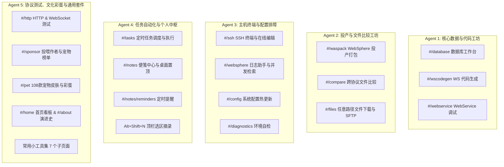

# Kairo v0.14 → v0.17 全功能深度分析与 5-Agent 并行 E2E 测试规范手册

> **测试核心准则**：
> 1. **全真实 UI 交互**：严禁直接调用后端 REST/WebSocket API，严禁直接读写内存/数据库/LocalStorage 绕过界面。所有操作必须通过真实的页面鼠标点击、键盘敲击/输入、下拉选择、拖拽拉伸与真实快捷键完成。
> 2. **每点击一次，截图审核一次（Click-Screenshot-Verification 铁律）**：每个交互动作后必须立即捕获视口/元素截图，并对照预期视觉呈现、DOM 状态、样式类名、Toast 提示及 Disabled 属性进行严格像素级审核。
> 3. **全主题 × 全分辨率矩阵覆盖**：5 套自绘主题（深色、浅色、护眼绿、高对比度、仙侠·墨韵青锋）与 3 类主流视口分辨率（1920×1080、1440×900、1280×800）全覆盖。
> 4. **5 Agent 隔离并行架构**：5 个测试 Agent 职责边界清晰，数据与操作互不冲突，持续运行直至找出所有阻塞性缺陷（Blocker）、功能异常与视觉瑕疵。

---

## 目录
1. [v0.14 → v0.17+ 功能演进与涉及页面全景分析](#1-v014--v017-功能演进与涉及页面全景分析)
2. [全页面功能与交互规范深度剖析](#2-全页面功能与交互规范深度剖析)
3. [测试执行铁律与多维度测试矩阵](#3-测试执行铁律与多维度测试矩阵)
4. [5 个 Agent 并行测试分工与隔离架构](#4-5-个-agent-并行测试分工与隔离架构)
5. [Agent 1 测试套件：数据库工作台与 WebService 代码生成](#5-agent-1-测试套件数据库工作台与-webservice-代码生成)
6. [Agent 2 测试套件：WebSphere 投产打包与跨协议文件比较](#6-agent-2-测试套件websphere-投产打包与跨协议文件比较)
7. [Agent 3 测试套件：SSH 终端、日志排障与系统配置](#7-agent-3-测试套件ssh-终端日志排障与系统配置)
8. [Agent 4 测试套件：定时任务、便笺中心与定时提醒](#8-agent-4-测试套件定时任务便笺中心与定时提醒)
9. [Agent 5 测试套件：HTTP/WS 测试、赞助宠物、主题与综合小工具](#9-agent-5-测试套件httpws-测试赞助宠物主题与综合小工具)
10. [持续测试监控、缺陷判定与阻塞上报规范](#10-持续测试监控缺陷判定与阻塞上报规范)

---

## 1. v0.14 → v0.17+ 功能演进与涉及页面全景分析

从 v0.14 到当前版本（v0.17 HEAD），Kairo 经历了从单一日志与命令工具向**综合运维/DBA/开发工作台**的重大架构演进，新增了 5 个核心业务页面、重构了 8 个历史页面，并引入了 Windows 原生桌面系统集成。

### 1.1 版本演进里程碑

| 版本 | 核心特性里程碑 | 涉及改动/新增的前端页面 | 后端与底层核心支撑 |
| :--- | :--- | :--- | :--- |
| **v0.14** | 投喂作者排行榜、About 性能大重构、公共调用器抽取 | `sponsor.js`, `about.js`, `home.js`, `index.html`, `style.css` | `internal/sponsor`, `internal/endpointclient`, IO 懒渲染 (-95% DOM) |
| **v0.15** | PET 养成游戏引擎、定时任务调度器、SSH 配置档案、HTTP cURL/WS 增强 | `pet.js`, `tasks.js`, `ssh.js`, `http.js`, `reminders.js`, `webservice.js` | `internal/pet`, `internal/schedtask`, `internal/cronx`, Job Object 进程树 |
| **v0.16** | 综合运维工作台、Windows 原生桌面集成、Oracle/MySQL/Redis 工作台初版、跨协议比对 | `database.js`, `compare.js`, `notes.js`, `notes-md.js`, `desknote`, `deskpet` | Win32 原生透明窗口、AES-256 凭据外置、108 款皮肤网格 |
| **v0.17** *(当前)* | 数据库工作台三段式专业化、WAS 投产打包、WSDL 客户端代码生成、原生路径选择器 | `waspack.js`, `wscodegen.js`, `database.js`, `compare.js`, `notes.js`, `config.js` | `internal/waspack`, `internal/wscodegen`, `internal/preferences`, 零依赖 Java 1.6 代码生成器 |

### 1.2 涉及改动的全量页面清单与路由映射

```mermaid
graph TD
    Main[Kairo 全局单页框架 index.html] --> Topbar[顶栏: 5套主题切换 / Alt+Shift+N 桌面便笺 / 状态灯]
    Main --> Nav[侧边栏导航分组]
    
    Nav --> G1[核心运维与研发]
    G1 --> P_Home[首页 Dashboard / #/home]
    G1 --> P_WS[日志助手 / #/websphere]
    G1 --> P_Files[文件下载 / #/files]
    G1 --> P_WASPack[投产打包 / #/waspack *新增*]
    G1 --> P_SSH[SSH 终端 / #/ssh]
    G1 --> P_DB[数据库工作台 / #/database *新增*]
    G1 --> P_HTTP[HTTP/WS 测试 / #/http]
    G1 --> P_SOAP[WebService / #/webservice]
    G1 --> P_WSCodegen[WS 代码生成 / #/wscodegen *新增*]
    G1 --> P_Diag[环境自检 / #/diagnostics]
    G1 --> P_Config[系统配置 / #/config]
    G1 --> P_Downloads[下载历史 / #/downloads]
    
    Nav --> G2[小工具集]
    G2 --> P_Fmt[报文格式化 / #/formatter]
    G2 --> P_Time[时间戳 / #/timestamp]
    G2 --> P_Cron[Cron 解析 / #/cron]
    G2 --> P_JSONPath[JSONPath / #/jsonpath]
    G2 --> P_Compare[文件与文本比较 / #/compare *重大重构*]
    G2 --> P_Cmd[常用命令 / #/commands]
    G2 --> P_Notes[便笺中心 / #/notes *新增*]
    G2 --> P_Tasks[定时任务 / #/tasks *新增*]
    
    Nav --> G3[其他]
    G3 --> P_Sponsor[投喂作者 / #/sponsor *新增*]
    G3 --> P_About[关于 Kairo / #/about *重构*]
    G3 --> P_Pet[宠物系统彩蛋 / #/pet *新增*]
```



---

## 2. 全页面功能与交互规范深度剖析

### 2.1 数据库工作台（`#/database`）
* **定位**：对标 PL/SQL Developer 与 DBeaver 的轻量、只读、多会话 SQL 查询与元数据工作台。
* **核心页面区域与组件**：
  1. **多会话查询标签栏（`#db-sql-tabs`）**：最多允许 6 个查询会话，支持 `+` 新增（`#db-tab-add`）、双击重命名、`×` 关闭标签、运行态小黄点脉冲动画。
  2. **数据源切换与连接管理（`#db-source`, `#db-manage-btn`）**：下拉选择数据源（Oracle/MySQL/Redis）；点击管理弹出模态框，支持配置名称、类型、Host、Port、SID/ServiceName/Database、Username、Keyring 密码存储、只读模式及连接测试（`#db-conn-test`）。
  3. **左侧元数据对象导航树（`#db-meta-panel`）**：支持搜索过滤（`#db-meta-filter`）；按 Tables（表）、Views（视图）、Functions（函数）、Procedures（存储过程）、Triggers（触发器）分类；单击查看字段定义（类型、Nullable、Comments），双击表名在编辑器生成 `SELECT * FROM ...`。
  4. **SQL 编辑区（`#db-sql`）**：支持 SQL Snippets 智能展开（输入 `sf` 按空格/Tab 展开为 `SELECT * FROM `）；支持多行编辑与行号；快捷键 `Ctrl+Enter` 执行、`Escape` 取消、`Ctrl+Shift+E` 查看执行计划。
  5. **结果工作区（`#db-grid`, `#db-record-view`）**：
     * **网格模式（Alt+1）**：虚拟滚动、列宽鼠标拖拽拉伸（持久化）、表头点击升降序排序、单列复制、隐藏列管理菜单（`#db-cols-btn`）、实时行内过滤（`#db-filter`）。
     * **单记录卡片模式（Alt+2）**：表单键值对展示当前选中行，支持上一条/下一条切换导航。
     * **持久化错误看板（`#db-error-box`）**：执行失败时不弹瞬时 Toast，而是在结果区保留结构化错误卡片（错误码、根本原因、建议、原始 SQL 复制）。
     * **CSV 导出（`#db-export`）**：带 UTF-8 BOM，一键将查询结果下载为表格。

### 2.2 WebSphere 投产打包（`#/waspack`）
* **定位**：面向银行信贷等老 Java 工程的精准增量打包工具。
* **核心页面区域与组件**：
  1. **路径与配置表单**：
     * 工程根目录（`#waspack-project`）与原生文件夹选择器按钮（`browseButton`）。
     * 输出目录（`#waspack-output`，自动填充当日 `TT<yyyyMMdd>` 推荐路径）。
     * 投产包名（`#waspack-pkg`，如 `TT20260902qijunV1`）。
     * 自动类名配对（`#waspack-autopair` 复选框，Java 自动映射 class 与内部类）。
  2. **投产清单输入区（`#waspack-manifest`）**：支持多格式（SVN Log、Git diff、绝对/相对路径）文本批量粘贴。
  3. **分析与预览（`#waspack-btn-preview`）**：
     * 扫描工程 `src/` 与 `WebRoot/WEB-INF/classes/`，按 `jsp`、`java`、`class` 分类归纳。
     * 错误/缺失文件红色警告列表，未编译 class 实时阻断提示。
  4. **一键打包执行（`#waspack-btn-build`）**：
     * 生成标准归档目录结构、抽取 class 文件。
     * 自动生成 `list.txt`、备份回滚脚本 `BakTT*.sh`、发布部署脚本 `TT*.sh` 及最终 `tar` 压缩包。
     * 产物定位按钮（`#waspack-btn-open-out`、`#waspack-btn-open-tar`）。

### 2.3 WebService 代码生成（`#/wscodegen`）
* **定位**：零外部依赖解析 WSDL 并生成 Java 1.6/1.8 客户端骨架代码与测试用例。
* **核心页面区域与组件**：
  1. **数据源模式切换**：本地项目已配 WSDL、本地单文件（`.wsdl`/`.xml`）、远程 URL 抓取、原始 XML 文本直接粘贴 4 种来源。
  2. **生成引擎与参数**：
     * 引擎下拉（`#wsc-engine`）：Portable（零依赖内置）、JAX-WS（JDK 内置）、CXF、Axis 1.4、Axis 2、XFire 1.2.6。
     * 包名配置（`#wsc-pkg`，如 `cn.com.kairo.ws.client`）、包含 Main 测试方法（`#wsc-inc-main`）。
  3. **WSDL 解析与骨架树（`#wsc-btn-scan`）**：解析 Service、Port、Binding、Operation 及 Input/Output 消息体，可视化展示操作列表。
  4. **代码预览与导出（`#wsc-btn-gen`, `#wsc-btn-zip`）**：
     * 右侧多标签代码预览器（接口 Interface、实现类 Client、数据传输对象 DTO、调用示例 Main）。
     * 一键生成到指定本地工程目录，或导出为完整的 zip 压缩包。

### 2.4 便笺中心与桌面便笺（`#/notes`, 顶栏 `#notes-toggle`）
* **定位**：运维临时笔记、排障参数摘录、桌面置顶看板与定时提醒中枢。
* **核心页面区域与组件**：
  1. **便笺列表页（`#/notes/list`）**：
     * 搜索栏（`.notes-search`）与状态筛选器（`.notes-filter`：未归档、页面悬浮、桌面置顶、已归档、全部）。
     * 卡片式看板：便笺色块背景（黄/绿/蓝/紫/红/灰）、标题、Markdown 内容渲染、更新时间。
     * 快捷操作：置顶到桌面、页面悬浮开关、设为提醒、归档、彻底删除。
  2. **内联编辑与新建（`+ 新建便笺`）**：直接在网格中创建卡片，双击内联编辑，无需弹窗阻断；底部 6 色拾色器即时变色。
  3. **顶栏便笺按钮与快捷键（`Alt+Shift+N`）**：
     * 任意页面有选中文字时，按下快捷键自动将选中文本摘录为新便笺内容。
     * Windows 原生桌面便笺双向同步，解决浏览器标签关闭后备忘丢失问题。
  4. **提醒管理选项卡（`#/notes/reminders`）**：
     * 3 种调度类型选项卡：单次提醒（指定日期时间）、每周循环（周一至周日多选 + 时间）、每月循环（1-31 日/最后一天 + 时间）。
     * 托盘联动：到点弹窗 + Toast 通知，支持“稍后提醒（10分钟）”或“今日暂停”。

### 2.5 定时任务管理（`#/tasks`）
* **定位**：基于 Cron 表达式在本地静默执行维护脚本（SVN 更新、Git 自动拉取、日志归档）。
* **核心页面区域与组件**：
  1. **任务列表看板**：任务名称、Cron 表达式（中文语义化解析展示）、下次触发时间、上次状态（成功/失败/超时/运行中）。
  2. **新增/编辑模态弹窗（`#task-btn-add`）**：
     * 调度预设下拉（每 5 分钟、每天 09:00、工作日等）或自定义 5 段式 Cron 表达式。
     * 执行命令输入框（支持 PowerShell/Cmd 复杂语法）、工作目录（带目录选择器）、执行超时时间（秒）。
  3. **任务动作**：启停 Toggle 开关、一键“立即运行”（`#task-btn-run`）、历史日志查看（`#task-btn-history`）。
  4. **运行历史抽屉**：展示最近 20 次执行记录（开始时间、耗时、退出码、标准输出/错误输出折叠面板）。

### 2.6 文件与文本比较工作台（`#/compare`）
* **定位**：支持 Local、SFTP、FTP 多协议的文件与文件夹深度比对。
* **核心页面区域与组件**：
  1. **左右源配置器**：左侧/右侧独立选择“文本/本地文件/本地文件夹/SFTP 目录/FTP 目录”，带编码自动识别（UTF-8/GBK/GB18030）。
  2. **比对控制工具栏**：
     * 策略切换：智能内容深度比对（哈希级校验）/ 极速元数据比对。
     * 过滤选项：忽略首尾空白（Trim）、忽略空行、忽略大小写、仅显示差异项（Only Diff）。
     * 视图模式：Side-by-Side（左右双栏）/ Inline（单栏逐行合并）。
  3. **文件夹树比对视图**：清晰标记差异文件（黄）、新增文件（绿/蓝）、缺失文件（红）、相同文件（灰）；双击进入单文件详细 Diff。
  4. **文本差异编辑器**：基于 diff2html 增强的行内字符级高亮、行号联动滚动、差异段跳转（上一个/下一个差异）、内容向左/向右同步合并按钮。

### 2.7 投喂作者与宠物系统（`#/sponsor`, `#/pet`）
* **核心页面区域与组件**：
  1. **投喂作者（`#/sponsor`）**：
     * 库迪/瑞幸/随机奶茶三栏赞助信息与赞助二维码展示。
     * 英雄榜前 50 赞助者排行卡片，带趣味武林花名前缀与杯数统计。
     * 异步安全机制：若后端排行榜服务不可达，呈现随机幽默武林文案与“再试一次”按钮，严禁暴露后端真实 IP 或 502 错误。
  2. **宠物养成彩蛋（`#/pet`）**：
     * 解锁机制：在关于页面 10 秒内连续点击 6 次触发宠物觉醒彩蛋。
     * 108 款精美精灵图皮肤选择网格（支持等级解锁与金币切换）。
     * 原生桌面悬浮窗联动：Win32 透明置顶窗口拖拽、抚摸交互、气泡对话。

---

## 3. 测试执行铁律与多维度测试矩阵

### 3.1 核心测试执行铁律 (Execution Invariants)

1. **绝对禁止后门调用**：
   * ❌ 严禁在浏览器控制台执行 `fetch('/api/...')` 或 `window.Kairo.api(...)`。
   * ❌ 严禁直接 `localStorage.setItem(...)` 注入测试状态。
   * ❌ 严禁手动修改本地 `config.yaml` 绕过页面保存流程。
   * ✅ 必须通过页面按钮点击（`.click()`）、输入框打字（`.fill()` / `.type()`）、下拉框选中（`.selectOption()`）等真实用户交互完成所有业务逻辑。

2. **每点击一次，截图审核一次 (Click & Screenshot Protocol)**：
   * 每一个有状态变更的操作（点击按钮、切换 Tab、提交表单、展开折叠、弹窗确认、排序、过滤输入），执行完成后必须等待页面 DOM 更新并完成 1 次截图。
   * 截图保存至统一目录：`docs/test-evidence/agent{X}/{case_id}_{step_idx}_{action_name}.png`。
   * 每个截图均需对照**视觉审核点（Visual Checkpoint）**进行断言验证。

3. **异常与控制台零容忍**：
   * 页面测试过程中，严禁出现未捕获的 JavaScript 异常（`Uncaught Error / TypeError`）。
   * 严禁网络请求出现意外的 404 或 500 错误。

### 3.2 5 套主题测试矩阵 (Multi-Theme Matrix)

| 主题标识 | 主题名称 | 核心色调与视觉特征 | 重点审核要点 |
| :--- | :--- | :--- | :--- |
| `dark` | **深色模式** *(默认)* | 灰黑背景 `#0f172a` / 卡片 `#1e293b` / 浅蓝主色 `#3b82f6` | 边框对比度、灰色文字（`--text-dim`）可读性、模态框阴影 |
| `light` | **浅色模式** | 白底 `#f8fafc` / 卡片 `#ffffff` / 深灰文字 `#0f172a` | 按钮悬停态区分度、输入框边框清晰度、选中态高亮对比 |
| `green` | **护眼绿** | 柔和豆沙绿 `#e8f5e9` / 墨绿文字 `#1b5e20` | 代码块背景对比、高亮标签色彩适配、Diff 增删颜色区分 |
| `hc` | **高对比度** | 纯黑 `#000000` / 纯白高亮文字 / 亮黄警告 / 粗边框 | 视障辅助级对比度（>= 7:1）、所有分割线 2px 实线清晰度 |
| `xianxia` | **仙侠·墨韵青锋** | 水墨青灰渐变背景 / 毛笔意境 / 翡翠青高亮 | 背景纹理层级、半透明磨砂卡片文字清晰度、古风徽章呈现 |

### 3.3 3 套分辨率测试矩阵 (Multi-Resolution Matrix)

| 分辨率规格 | 视口尺寸 (Width × Height) | 目标设备场景 | 重点审核要点 |
| :--- | :--- | :--- | :--- |
| **标准桌面** | **1920 × 1080** | 现代主流 1080P/2K 显示器 | 左右分栏饱满度、大数据量表格铺满、多列展示无多余空白 |
| **紧凑笔记本** | **1440 × 900** / **1366 × 768** | 运维便携本、生产堡垒机客户端 | 左右分栏自动折行/弹性收缩、弹窗居中且不超视口、表格横向滚动条正常 |
| **小屏/投影** | **1280 × 800** / **1024 × 768** | 机房小推车终端、会议投屏演示 | 侧边栏与主工作区自适应、顶部工具栏按钮换行不溢出、底部 Sticky 栏不遮挡内容 |

---

## 4. 5 个 Agent 并行测试分工与隔离架构

为了实现高效、无死锁、无数据踩踏的持续并行测试，将全部 22 个功能页面与系统交互科学划分为 5 个独立的测试 Agent。



### 4.1 Agent 资源与数据隔离原则

1. **测试数据源隔离**：
   * Agent 1 独占测试数据库数据源 `kairo_lab_agent1`（Oracle/MySQL 测试实例）。
   * Agent 2 独占本地测试工程目录 `testdata/waspack/` 与 `testdata/compare/`。
   * Agent 3 独占 Mock SSH 端口 `18022` 与测试日志路径 `testdata/logs/`。
   * Agent 4 独占任务 ID 空间 `task_agent4_*` 与便笺命名空间 `note_agent4_*`。
   * Agent 5 独占 HTTP Mock 服务端口 `18088` 与 WebSocket Echo 端口 `18089`。
2. **浏览器上下文隔离**：
   * 每个 Agent 启动独立的 Playwright BrowserContext（独立的 Session 与独立 LocalStorage 实例）。
   * 各 Agent 独立循环 5 套主题与 3 种分辨率，互不干扰。

---

## 5. Agent 1 测试套件：数据库工作台与 WebService 代码生成

* **覆盖页面**：`#/database`、`#/wscodegen`、`#/webservice`
* **Agent 职责**：负责全应用最复杂的数据查询、元数据树解析、代码生成、SOAP 报文交互及快捷键体系。

### 5.1 数据库工作台完整交互测试用例 (TC-DB-01 ~ TC-DB-06)

#### 用例 TC-DB-01：数据源管理与元数据对象树导航
1. **步骤 1（页面访问与初始渲染）**：
   * 动作：点击左侧侧边栏“数据库工作台”（`a[data-route="database"]`）。
   * 截图点：`agent1/TC-DB-01_step1_nav_database.png`。
   * 审核要点：面包屑显示“数据库工作台”，数据源下拉框（`#db-source`）可见，三段式工作区（左侧元数据、右上编辑器、右下结果区）布局清晰。
2. **步骤 2（新增数据源）**：
   * 动作：点击“管理数据源”按钮（`#db-manage-btn`），在弹窗中选择类型 `MySQL`，输入名称 `TestDB_MySQL`，Host `127.0.0.1`，Port `3306`，Database `kairo_test`，User `root`，Password `pass123`，点击“测试连接”（`#db-conn-test`）。
   * 截图点：`agent1/TC-DB-01_step2_conn_test.png`。
   * 审核要点：弹窗显示“连接成功，耗时 XX ms”绿色提示，测试按钮恢复可用。
3. **步骤 3（保存数据源与元数据加载）**：
   * 动作：点击“保存”（`#db-conn-save`），弹窗自动关闭，数据源下拉框自动选中 `TestDB_MySQL`。
   * 截图点：`agent1/TC-DB-01_step3_source_loaded.png`。
   * 审核要点：左侧元数据树（`#db-meta-panel`）展开，出现 Tables（表）、Views（视图）、Functions（函数）分组，显示表数量徽章。
4. **步骤 4（元数据树交互与拖拽拉伸）**：
   * 动作：在元数据搜索框（`#db-meta-filter`）输入 `user`，展开 `t_user` 表，查看字段列表；鼠标按住分割条（`.db-meta-splitter`）向右拖动 100px。
   * 截图点：`agent1/TC-DB-01_step4_meta_filter_and_resize.png`。
   * 审核要点：对象树仅显示匹配项，字段列表清晰展示字段名、类型（`VARCHAR(64)`）、主键图标；左侧面板宽度变为 320px 且布局无错乱。

#### 用例 TC-DB-02：多会话页签、Snippets 补全与 SQL 执行
1. **步骤 1（新建查询页签）**：
   * 动作：点击页签栏右侧 `+` 按钮（`#db-tab-add`），再点击一次。
   * 截图点：`agent1/TC-DB-02_step1_tabs_created.png`。
   * 审核要点：标签栏出现“查询 1”、“查询 2”、“查询 3”，当前激活“查询 3”。
2. **步骤 2（Snippet 触发与编辑）**：
   * 动作：在编辑器中输入 `sf` 并敲击空格键（Space）。
   * 截图点：`agent1/TC-DB-02_step2_snippet_expanded.png`。
   * 审核要点：`sf ` 瞬间自动展开为 `SELECT * FROM `，光标停留在末尾。
3. **步骤 3（双击元数据树生成 SQL）**：
   * 动作：双击左侧元数据树中的 `t_user` 表项。
   * 截图点：`agent1/TC-DB-02_step3_table_double_clicked.png`。
   * 审核要点：编辑器内容变为 `SELECT * FROM t_user`，页签标题自动更新为 `SELECT * FROM t_user`。
4. **步骤 4（快捷键执行 SQL）**：
   * 动作：在编辑器中按下快捷键 `Ctrl+Enter`。
   * 截图点：`agent1/TC-DB-02_step4_sql_running_and_done.png`。
   * 审核要点：执行按钮状态变为 Running，状态栏显示“查询成功，返回 XX 行，耗时 XX ms”，结果区网格呈现数据。

#### 用例 TC-DB-03：结果网格交互、排序、列宽调整与持久化错误看板
1. **步骤 1（列宽拖拽与排序）**：
   * 动作：鼠标悬停在表头 `username` 与 `email` 之间的调整把手（`.db-grid-resize-handle`），向右拖拽 60px；点击 `created_at` 表头。
   * 截图点：`agent1/TC-DB-03_step1_col_resize_sort.png`。
   * 审核要点：`username` 列宽扩大，表头出现升序箭头 `▲`，表格行按时间排序。
2. **步骤 2（列显隐与行内过滤）**：
   * 动作：点击列管理按钮（`#db-cols-btn`），取消勾选 `id` 列；在结果过滤框（`#db-filter`）输入 `admin`。
   * 截图点：`agent1/TC-DB-03_step2_filter_cols.png`。
   * 审核要点：`id` 列从网格中隐藏，网格仅展示包含 `admin` 的数据行，底部显示“显示 X / Y 行”。
3. **步骤 3（单记录视图切换）**：
   * 动作：按下快捷键 `Alt+2`（切换单记录模式），点击“下一条”（`#db-record-next`）。
   * 截图点：`agent1/TC-DB-03_step3_record_view.png`。
   * 审核要点：视图切换为卡片式单记录表单，展示字段与值的对照表，当前索引变为 `2 / Y`。
4. **步骤 4（持久化错误看板测试）**：
   * 动作：在编辑器输入错误的 SQL `SELECT * FROM non_existent_table_999` 并按 `Ctrl+Enter`。
   * 截图点：`agent1/TC-DB-03_step4_error_board.png`。
   * 审核要点：结果区持久展示红色错误卡片（`#db-error-box`），包含 Table doesn't exist 错误明细、排查建议、原 SQL 文本及一键“复制错误”按钮，无遮挡性 Toast。

### 5.2 WebService 代码生成交互测试用例 (TC-WSC-01 ~ TC-WSC-04)

#### 用例 TC-WSC-01：WSDL 来源切换与骨架解析
1. **步骤 1（访问代码生成页）**：
   * 动作：点击侧边栏“WebService 代码生成”（`a[data-route="wscodegen"]`）。
   * 截图点：`agent1/TC-WSC-01_step1_nav.png`。
   * 审核要点：展示 4 种来源单选按钮（本地项目、本地文件、远程 URL、粘贴内容），默认选中“本地项目”。
2. **步骤 2（粘贴 WSDL 文本与解析）**：
   * 动作：切换到“粘贴内容”单选框，在文本框（`#wsc-wsdl-content`）粘贴标准 `LoanService.wsdl` 内容，点击“解析 WSDL”（`#wsc-btn-scan`）。
   * 截图点：`agent1/TC-WSC-02_step2_parsed.png`。
   * 审核要点：左下方呈现服务树（Service: `LoanService` -> Port: `LoanServiceHttpPort` -> Operations: `applyLoan`, `queryStatus`），解析状态显示为“解析成功”。

#### 用例 TC-WSC-02：生成参数配置、代码预览与 ZIP 导出
1. **步骤 1（配置引擎与包名）**：
   * 动作：选择生成引擎为 `Portable (Java 1.6 零依赖)`，输入包名 `cn.com.jscb.loan.ws`，勾选“包含 Main 测试方法”（`#wsc-inc-main`）。
   * 截图点：`agent1/TC-WSC-02_step1_config.png`。
   * 审核要点：表单输入校验通过，引擎提示语显示“零依赖，Java 1.6，编不过栈时用这个”。
2. **步骤 2（生成与多文件代码预览）**：
   * 动作：点击“生成客户端代码”（`#wsc-btn-gen`）。
   * 截图点：`agent1/TC-WSC-02_step2_preview.png`。
   * 审核要点：右侧代码预览器出现文件树（`LoanService.java`, `LoanServiceClient.java`, `ApplyLoanRequest.java`, `Main.java`），点击各文件能正常切换语法高亮预览。
3. **步骤 3（导出 ZIP 压缩包）**：
   * 动作：点击“导出 ZIP 压缩包”（`#wsc-btn-zip`）。
   * 截图点：`agent1/TC-WSC-02_step3_zip_download.png`。
   * 审核要点：触发浏览器文件下载，保存为 `LoanService_ws_client.zip`，提示“ZIP 导出成功”。

---

## 6. Agent 2 测试套件：WebSphere 投产打包与跨协议文件比较

* **覆盖页面**：`#/waspack`、`#/compare`、`#/files`
* **Agent 职责**：负责生产投产清单分析打包、脚本生成、跨协议文件与目录智能对比及 SFTP 传输。

### 6.1 WebSphere 投产打包测试用例 (TC-WAS-01 ~ TC-WAS-03)

#### 用例 TC-WAS-01：投产清单解析、自动配对与校验
1. **步骤 1（进入页面与偏好回填）**：
   * 动作：点击侧边栏“投产打包”（`a[data-route="waspack"]`）。
   * 截图点：`agent2/TC-WAS-01_step1_enter.png`。
   * 审核要点：页面恢复上次保存的工程目录偏好，包名输入框默认填充今日日期 `TT<yyyyMMdd>` 前缀。
2. **步骤 2（粘贴混杂清单与自动配对）**：
   * 动作：在工程根目录（`#waspack-project`）输入 `D:\kairo\testdata\mock_credit_project`，在投产清单（`#waspack-manifest`）粘贴包含 Java 源文件、JSP、class 内部类（`$1.class`）的清单文本，确保“自动类名配对”（`#waspack-autopair`）勾选。
   * 截图点：`agent2/TC-WAS-01_step2_manifest_pasted.png`。
   * 审核要点：输入框内容完整，无格式错乱。
3. **步骤 3（点击分析与预览）**：
   * 动作：点击“分析与预览”（`#waspack-btn-preview`）。
   * 截图点：`agent2/TC-WAS-01_step3_preview_grid.png`。
   * 审核要点：分析汇总卡片显示“共识别 X 个条目：Java X 个（配对 Class Y 个）、JSP Z 个”，文件表格清晰列出源路径与映射的目标路径，状态全绿（Found）。

#### 用例 TC-WAS-02：一键打包执行、脚本校验与产物定位
1. **步骤 1（执行打包）**：
   * 动作：输入输出目录 `D:\kairo\testdata\packs\TT20260902V1`，点击“一键打包并生成脚本”（`#waspack-btn-build`）。
   * 截图点：`agent2/TC-WAS-02_step1_build_success.png`。
   * 审核要点：按钮显示 Loading 后提示“打包成功！”，下方生成 3 个脚本预览卡片（`list.txt`、`BakTT*.sh`、`TT*.sh`）与产物定位按钮。
2. **步骤 2（脚本内容点击查看与复制）**：
   * 动作：分别点击切换 `BakTT*.sh` 与 `TT*.sh` 选项卡，点击右上角“复制脚本”按钮。
   * 截图点：`agent2/TC-WAS-02_step2_scripts_view.png`。
   * 审核要点：脚本内容包含绝对路径替换规则与回滚机制，复制后弹出 Toast 提示“脚本已复制到剪贴板”。

### 6.2 跨协议文件与文本比较测试用例 (TC-CMP-01 ~ TC-CMP-03)

#### 用例 TC-CMP-01：智能内容比较与目录树差异扫描
1. **步骤 1（选择左右比对源）**：
   * 动作：进入“文件与文本比较”（`a[data-route="compare"]`），左侧选择本地目录 `D:\kairo\testdata\dir_a`，右侧选择本地目录 `D:\kairo\testdata\dir_b`。
   * 截图点：`agent2/TC-CMP-01_step1_sources_selected.png`。
   * 审核要点：左右源路径回显正确，比对策略默认显示为“智能内容比较”。
2. **步骤 2（执行差异比对）**：
   * 动作：点击“开始比对”按钮。
   * 截图点：`agent2/TC-CMP-01_step2_tree_diff.png`。
   * 审核要点：下方呈现目录差异树，准确标识：`config.xml`（内容差异·黄色）、`new_feature.js`（仅右侧·蓝色）、`legacy.log`（仅左侧·红色）、`identical.txt`（相同·灰色）。
3. **步骤 3（勾选仅显示差异与过滤）**：
   * 动作：勾选“仅显示差异”（`#cmp-opt-only-diff`），在过滤框输入 `.xml`。
   * 截图点：`agent2/TC-CMP-01_step3_filtered_diff.png`。
   * 审核要点：目录树中相同文件被过滤，仅保留 `config.xml`。

#### 用例 TC-CMP-02：单文件 Diff 交互、双栏/单栏切换与差异跳转
1. **步骤 1（进入文件 Diff）**：
   * 动作：双击差异树中的 `config.xml`。
   * 截图点：`agent2/TC-CMP-02_step1_file_diff_side.png`。
   * 审核要点：进入 Side-by-Side 双栏 Diff 视图，差异行黄色背景，行内字符增删有红绿色块高亮。
2. **步骤 2（差异段导航与模式切换）**：
   * 动作：点击“下一个差异”按钮（`↓`）；再点击“单栏合并视图”（Inline）。
   * 截图点：`agent2/TC-CMP-02_step2_inline_mode.png`。
   * 审核要点：视图滚动至下一处差异，模式平滑切换为 Inline 单栏视图，行号对应无错位。

---

## 7. Agent 3 测试套件：SSH 终端、日志排障与系统配置

* **覆盖页面**：`#/ssh`、`#/websphere`、`#/config`、`#/diagnostics`
* **Agent 职责**：负责主机连接档案管理、xterm 终端渲染、日志多目标矩阵搜索、上下文提取、系统配置热加载及环境自检。

### 7.1 SSH 终端与 SFTP 文件管理 (TC-SSH-01 ~ TC-SSH-03)

#### 用例 TC-SSH-01：Profile 档案持久化、连接与 xterm 终端交互
1. **步骤 1（保存连接配置档案）**：
   * 动作：进入“SSH 终端”（`a[data-route="ssh"]`），输入 Host `127.0.0.1`，Port `18022`，User `appops`，Password `kairoPass`，档案名输入 `生产堡垒机-01`，点击“保存配置档案”（`#ssh-profile-save`）。
   * 截图点：`agent3/TC-SSH-01_step1_profile_saved.png`。
   * 审核要点：配置档案下拉列表中出现 `生产堡垒机-01 (appops@127.0.0.1:18022)`，密码进入系统安全存储。
2. **步骤 2（建立终端连接与命令敲击）**：
   * 动作：点击“连接终端”（`#ssh-connect-btn`），连接建立后在 xterm 终端内输入命令 `uname -a && uptime` 并回车。
   * 截图点：`agent3/TC-SSH-01_step2_term_output.png`。
   * 审核要点：xterm.js 渲染 Linux 欢迎 Banner，命令执行结果正常输出，终端光标稳定闪烁。
3. **步骤 3（终端内搜索与全屏弹窗）**：
   * 动作：按 `Ctrl+F` 调出终端搜索框，输入 `Linux`；点击顶栏“独立窗口打开”。
   * 截图点：`agent3/TC-SSH-01_step3_term_search.png`。
   * 审核要点：终端命中关键词黄色高亮，搜索条展示匹配数量。

### 7.2 WebSphere 日志助手与并发检索 (TC-WSL-01 ~ TC-WSL-03)

#### 用例 TC-WSL-01：多服务器 × 多目录矩阵勾选与并发搜索
1. **步骤 1（选择业务系统与多目标矩阵）**：
   * 动作：进入“日志助手”（`a[data-route="websphere"]`），选择系统“信贷核心系统”，在服务器列表同时勾选 `Server-01` 与 `Server-02` 下的 `AppLog` 目录。
   * 截图点：`agent3/TC-WSL-01_step1_targets_selected.png`。
   * 审核要点：目标卡片显示“已选 2 个目标 (2 服务器 × 1 目录)”。
2. **步骤 2（复杂语法搜索与命中统计）**：
   * 动作：在搜索框输入 `NullPointerException && !DEBUG`，点击“搜索日志”（`#ws-search-btn`）。
   * 截图点：`agent3/TC-WSL-01_step2_search_results.png`。
   * 审核要点：结果按服务器分组展示，显示命中条数与耗时，命中行关键词橙色高亮。
3. **步骤 3（查看前后 30 行上下文）**：
   * 动作：点击某命中行的“查看上下文”按钮（`.ws-hit-ctx-btn`）。
   * 截图点：`agent3/TC-WSL-01_step3_context_view.png`。
   * 审核要点：下方无刷新展开前后 30 行日志卡片，命中行保持高亮，行号连续，支持独立上下滚动。

### 7.3 系统配置热加载与环境自检 (TC-CFG-01 ~ TC-CFG-02)

#### 用例 TC-CFG-01：系统配置可视化增删与 COW 热保存
1. **步骤 1（修改配置与离开警告）**：
   * 动作：进入“系统配置”（`a[data-route="config"]`），添加一台新服务器 `Server-03`；此时尝试点击左侧菜单“首页”。
   * 截图点：`agent3/TC-CFG-01_step1_leave_confirm.png`。
   * 审核要点：弹出浏览器确认弹窗“系统配置有未保存的改动，确定要离开吗？”，点击取消留在当前页。
2. **步骤 2（保存配置与 COW 生效）**：
   * 动作：点击底部悬浮栏“保存配置”按钮。
   * 截图点：`agent3/TC-CFG-01_step2_config_saved.png`。
   * 审核要点：底部提示“配置已保存并即时生效”，无需重启服务。

---

## 8. Agent 4 测试套件：定时任务、便笺中心与定时提醒

* **覆盖页面**：`#/tasks`、`#/notes`、`#/notes/reminders`、顶栏 `#notes-toggle`
* **Agent 职责**：负责本地进程自动化任务调度、桌面原生置顶便笺联动、选区快速摘录、Markdown 渲染及定时提醒全闭环。

### 8.1 定时任务管理测试用例 (TC-TSK-01 ~ TC-TSK-03)

#### 用例 TC-TSK-01：新增 Cron 定时任务与参数配置
1. **步骤 1（打开新增任务模态框）**：
   * 动作：进入“定时任务”（`a[data-route="tasks"]`），点击“+ 新建定时任务”（`#task-btn-add`）。
   * 截图点：`agent4/TC-TSK-01_step1_add_modal.png`。
   * 审核要点：弹出居中模态框，包含任务名称、调度预设、自定义 Cron、执行命令、工作目录、超时时间。
2. **步骤 2（表单填写与保存）**：
   * 动作：输入名称 `SVN 自动化更新`，预设选择 `每 5 分钟 (*/5 * * * *)`，命令输入 `echo "SVN Update OK"`，点击“保存任务”。
   * 截图点：`agent4/TC-TSK-01_step2_task_saved.png`。
   * 审核要点：弹窗关闭，列表新增任务卡片，状态为启用，解析显示“每 5 分钟执行一次”，计算出下次执行时间。

#### 用例 TC-TSK-02：手动触发执行与运行历史折叠抽屉
1. **步骤 1（点击立即运行）**：
   * 动作：点击该任务卡片的“立即运行”按钮（`.task-btn-run`）。
   * 截图点：`agent4/TC-TSK-02_step1_task_running.png`。
   * 审核要点：任务状态徽章变为黄色的“运行中”（`tag-busy`），每 2s 轮询刷新。
2. **步骤 2（查看运行历史与标准输出）**：
   * 动作：等待执行完成后（徽章变绿 `成功`），点击“运行历史”按钮（`.task-btn-history`）。
   * 截图点：`agent4/TC-TSK-02_step2_history_modal.png`。
   * 审核要点：弹出历史抽屉，展示本次执行的开始时间、耗时、退出码 0，展开输出卡片可见 `SVN Update OK`。

### 8.2 便笺中心、桌面置顶与选区摘录 (TC-NOTE-01 ~ TC-NOTE-03)

#### 用例 TC-NOTE-01：便笺看板新建、6 色切换与 Markdown 渲染
1. **步骤 1（内联新建便笺）**：
   * 动作：进入“便笺”（`a[data-route="notes"]`），点击“+ 新建便笺”。
   * 截图点：`agent4/TC-NOTE-01_step1_inline_create.png`。
   * 审核要点：网格顶部插入空白便笺编辑卡片，光标聚焦在标题输入框。
2. **步骤 2（输入 Markdown 与切换颜色）**：
   * 动作：输入标题 `生产排障注意点`，正文输入 `### 步骤\n- 检查 CPU\n- 查看 **GC 日志**`，点击底部的“绿色”拾色块。
   * 截图点：`agent4/TC-NOTE-02_step2_note_styled.png`。
   * 审核要点：卡片背景立即变为护眼绿色，点击保存后标题与正文以 Markdown 格式正确排版渲染。

#### 用例 TC-NOTE-02：选区快速摘录与置顶桌面便笺
1. **步骤 1（选区快捷键摘录）**：
   * 动作：切换到“关于”页面，用鼠标划选文本“纯 Go 单 exe 零依赖”，按下全局快捷键 `Alt+Shift+N`（或点击顶栏便笺按钮 `#notes-toggle`）。
   * 截图点：`agent4/TC-NOTE-02_step1_clipping_created.png`。
   * 审核要点：弹出 Toast 提示“已摘录选中文本为新便笺”，便笺中心新增一条包含该文本的便笺。
2. **步骤 2（设为桌面置顶）**：
   * 动作：在便笺卡片上点击“置顶到桌面”图标按钮。
   * 截图点：`agent4/TC-NOTE-02_step2_desktop_pin.png`。
   * 审核要点：卡片出现置顶徽章，Windows 原生桌面同步生成对应的置顶半透明便笺。

### 8.3 定时提醒闭环 (TC-REM-01 ~ TC-REM-02)

#### 用例 TC-REM-01：从便笺创建提醒与 3 种调度类型
1. **步骤 1（便笺一键转提醒）**：
   * 动作：点击便笺卡片上的“设为提醒”时钟图标。
   * 截图点：`agent4/TC-REM-01_step1_convert_remind.png`。
   * 审核要点：自动切换到“提醒”选项卡，自动弹出新建提醒弹窗，正文已自动填入便笺标题与内容。
2. **步骤 2（配置周循环提醒）**：
   * 动作：选择“每周循环”选项卡，勾选“周一至周五”，设置时间为当前时间的 1 分钟后，点击保存。
   * 截图点：`agent4/TC-REM-01_step2_weekly_saved.png`。
   * 审核要点：提醒列表中出现新条目，显示为启用态，倒计时正常计算。

---

## 9. Agent 5 测试套件：HTTP/WS 测试、赞助宠物、主题与综合小工具

* **覆盖页面**：`#/http`、`#/sponsor`、`#/pet`、`#/home`、`#/about`、`#/formatter`、`#/timestamp`、`#/cron`、`#/jsonpath`、`#/commands`、`#/downloads`
* **Agent 职责**：负责 API 与 WebSocket 通信测试、赞助榜单搞笑容错、宠物觉醒彩蛋、首页布局、关于页面 12 section 懒渲染、5 套主题全栈穿透与 7 个小工具页面。

### 9.1 HTTP / WebSocket 测试客户端 (TC-HTTP-01 ~ TC-HTTP-03)

#### 用例 TC-HTTP-01：Raw cURL 智能导入与一键请求
1. **步骤 1（导入 cURL 命令行）**：
   * 动作：进入“HTTP 测试”（`a[data-route="http"]`），点击“cURL 导入”按钮，粘贴 `curl -X POST http://127.0.0.1:18088/api/test -H "Content-Type: application/json" -d '{"name":"kairo","env":"prod"}'`，点击“解析并填入”。
   * 截图点：`agent5/TC-HTTP-01_step1_curl_parsed.png`。
   * 审核要点：Method 自动切换为 `POST`，URL、Headers 表格、Body JSON 编辑区均被准确回填。
2. **步骤 2（发送请求与响应格式化美化）**：
   * 动作：点击“发送请求”（`#http-send-btn`），收到响应后点击响应区“美化”按钮。
   * 截图点：`agent5/TC-HTTP-01_step2_response_beauty.png`。
   * 审核要点：状态码显示 `200 OK`（绿色），响应耗时与大小正常回显，JSON 响应高亮格式化展开。

#### 用例 TC-HTTP-02：WebSocket 双向通信与消息流式看板
1. **步骤 1（建立 WS 连接）**：
   * 动作：切换到“WebSocket”模式选项卡，输入 `ws://127.0.0.1:18089/echo`，点击“连接”。
   * 截图点：`agent5/TC-HTTP-02_step1_ws_connected.png`。
   * 审核要点：连接状态指示灯变绿，显示“已连接”。
2. **步骤 2（发送与接收消息）**：
   * 动作：在消息框输入 `Hello Kairo Server` 并点击发送。
   * 截图点：`agent5/TC-HTTP-02_step2_ws_message_stream.png`。
   * 审核要点：消息看板以聊天气泡形式呈现上行（发出·蓝色）与下行（回显·绿色）数据流，带毫秒级时间戳。

### 9.2 投喂作者、宠物彩蛋与关于页面 (TC-SPO-01 ~ TC-SPO-03)

#### 用例 TC-SPO-01：赞助排行榜异步加载与失败随机幽默兜底
1. **步骤 1（访问投喂作者页）**：
   * 动作：点击侧边栏“投喂作者”（`a[data-route="sponsor"]`）。
   * 截图点：`agent5/TC-SPO-01_step1_sponsor_view.png`。
   * 审核要点：页面静态卡片（品牌介绍、赞助码）瞬间渲染，排行榜区域显示 Loading。
2. **步骤 2（排行榜容错与安全测试）**：
   * 动作：在模拟断网或后端未配置环境下查看榜单区呈现。
   * 截图点：`agent5/TC-SPO-01_step2_quip_fallback.png`。
   * 审核要点：榜单区展示随机武林幽默提示（如“大侠正在赶来的路上”），**严禁出现后端内部 IP、端口或 502 等错误敏感信息**，提供“再试一次”按钮。

#### 用例 TC-SPO-02：关于页面 6 击彩蛋触发与 108 款皮肤网格
1. **步骤 1（连续 6 次点击触发彩蛋）**：
   * 动作：进入“关于”（`a[data-route="about"]`），在 10 秒内连续点击左侧菜单“关于”项 6 次。
   * 截图点：`agent5/TC-SPO-02_step1_pet_unlocked.png`。
   * 审核要点：屏幕中央弹出特效 Toast 提示“天命契机已觉醒！”，左侧菜单新增“宠物小窝”入口。
2. **步骤 2（108 款皮肤网格交互）**：
   * 动作：点击进入宠物页面，浏览 108 款精灵图皮肤网格，点击切换为“柴犬”皮肤。
   * 截图点：`agent5/TC-SPO-02_step2_skins_grid.png`。
   * 审核要点：皮肤卡片被激活选中，预览画布实时播放柴犬逐帧跑动动画，无 404 碎图。

### 9.3 5 套主题全栈穿透与通用小工具集 (TC-THM-01 ~ TC-THM-02)

#### 用例 TC-THM-01：顶栏主题 5 态循环切换与全组件穿透
1. **步骤 1（主题循环切换与截图）**：
   * 动作：依次点击右上角主题切换按钮（`#theme-toggle`）共 5 次，遍历 `dark` -> `light` -> `green` -> `hc` -> `xianxia`。
   * 截图点：
     * `agent5/TC-THM-01_theme_dark.png`
     * `agent5/TC-THM-01_theme_light.png`
     * `agent5/TC-THM-01_theme_green.png`
     * `agent5/TC-THM-01_theme_hc.png`
     * `agent5/TC-THM-01_theme_xianxia.png`
   * 审核要点：`<html>` 标签的 `data-theme` 属性正确更新，侧栏、顶栏、主卡片、输入框、表格各元素颜色完全符合对应主题规范，文字可读性达标，无样式残留。

#### 用例 TC-THM-02：报文格式化、时间戳、Cron 等 7 个小工具遍历
1. **步骤 1（报文格式化 JSON/XML/SQL）**：
   * 动作：进入“报文格式化”（`#/formatter`），分别测试未压缩 JSON、脏 XML、单行 SQL 的一键格式化与高亮。
   * 截图点：`agent5/TC-TOOL-01_formatter.png`。
   * 审核要点：缩进规整（2空格/4空格可选），高亮无语法错误。
2. **步骤 2（时间戳与 Cron 解析）**：
   * 动作：进入“时间戳”（`#/timestamp`）与“Cron 解析”（`#/cron`），输入当前时间戳及 `0 0 12 * * ?`。
   * 截图点：`agent5/TC-TOOL-02_time_cron.png`。
   * 审核要点：时间戳转换准确，Cron 解析生成接下来 5 次运行时间列表。

---

## 10. 持续测试监控、缺陷判定与阻塞上报规范

### 10.1 缺陷严重度分级定义 (Severity Levels)

| 级别 | 定义与影响范围 | 判定准则 | 处理时限与阻断要求 |
| :--- | :--- | :--- | :--- |
| **P0 (Blocker)** | **致命阻塞** | 页面白屏崩溃、JS 致命抛错导致无法交互、死锁卡死、核心保存丢失数据、真实进程泄漏无法杀死 | **立即阻断发布**，测试 Agent 暂停当前链条并高优先级报警 |
| **P1 (Critical)** | **严重功能缺陷** | 功能不可用（如 SQL 无法执行、打包产物缺失、比对误报差异、SSH 无法输入）、快捷键失效 | 24 小时内修复并触发 Agent 回归测试 |
| **P2 (Major)** | **UI/交互与体验缺陷** | 某主题下文字对比度低看不清、小分辨率下弹窗溢出无法关闭、表格拖拽列宽跳动、缺少操作反馈 | 发版前收口修复 |
| **P3 (Minor)** | **轻微瑕疵/建议** | 错别字、提示文案不够亲切、微小像素不对齐 | 纳入后续迭代体验打磨 |

### 10.2 缺陷记录与审核工单模板 (Issue Report Template)

当任意 Agent 在测试过程中发现缺陷或阻塞时，必须严格按以下 Markdown 模板在 `docs/issues/` 下记录归档：

```markdown
# [BUG-P{X}] {模块名称} - {缺陷简要描述}

- **发现 Agent**：Agent {1|2|3|4|5}
- **涉及路由**：`#/{route}`
- **测试环境**：Windows 11 / Theme: `{dark|light|green|hc|xianxia}` / Viewport: `{1920x1080|1440x900|1280x800}`
- **触发用例编号**：`TC-{MODULE}-{NO}`（步骤 {N}）

### 1. 真实操作复现步骤 (Exact Reproduction Steps)
1. 打开页面 `#{route}`
2. 鼠标点击 `{CSS Selector}`
3. 键盘输入 `{Input Text}`
4. 点击提交按钮 `{Button Selector}`

### 2. 预期视觉效果与行为 (Expected Result)
- 预期应当看到 ...（对照 Checkpoint 描述）

### 3. 实际异常表现 (Actual Result & Blocker)
- 实际出现 ...（页面无响应 / 报错 / 样式错乱）

### 4. 证据链 (Evidence)
- **步骤截图**：``
- **控制台错误 (Console)**：
  ```
  Uncaught TypeError: Cannot read properties of undefined (reading 'xxx')
  ```
- **DOM 状态与网络抓包**：
  - 触发元素：`<button id="xxx" class="...">`
  - 响应码：`500 Internal Server Error`

### 5. 修复与回归闭环要求 (Verification Criteria)
- [ ] 修复代码已合并
- [ ] 5 套主题下重新执行本用例通过
- [ ] 3 种分辨率下视觉审核无遮挡
```

---

## 11. 执行启动与持续运行指南

1. **环境准备**：
   * 启动 Kairo 本地服务：`go run . --config ./config.yaml`（监听端口 `18092`）。
   * 启动 Mock 服务支持（SSH `18022`、HTTP Mock `18088`、WS Echo `18089`）。
2. **5 Agent 并行指令集**：
   * 各 Agent 分配独立终端，分别运行专有测试套件，产出全量截图至 `docs/test-evidence/`。
   * 持续比对最新截图与基线，捕捉每一次前端代码提交引入的回归问题！
